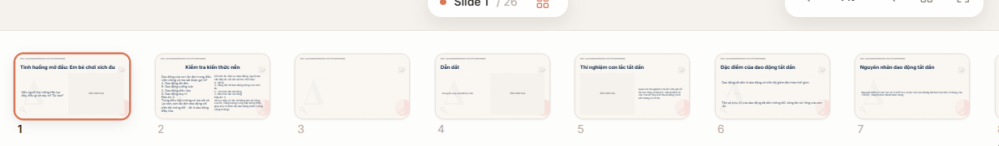
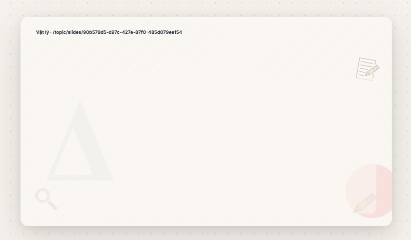
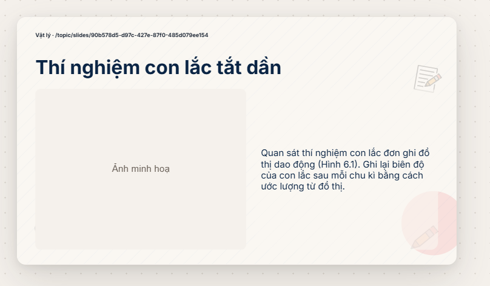
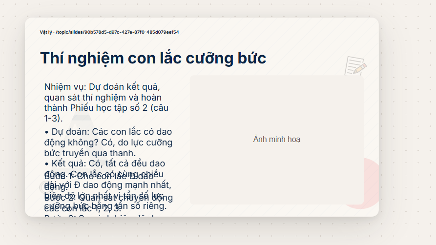
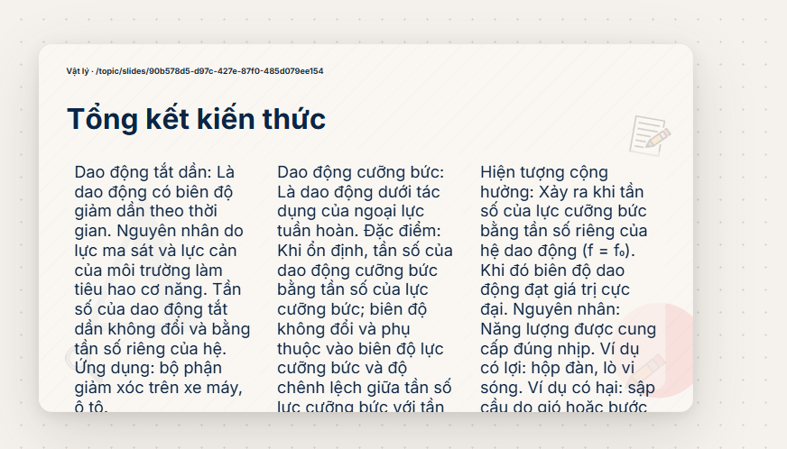
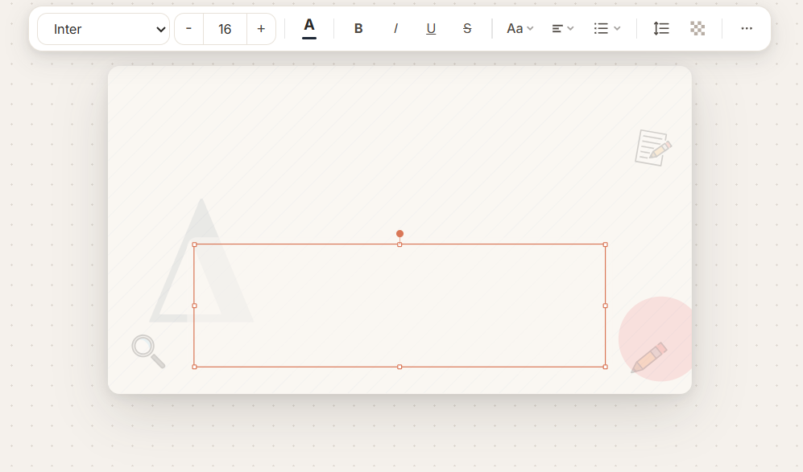
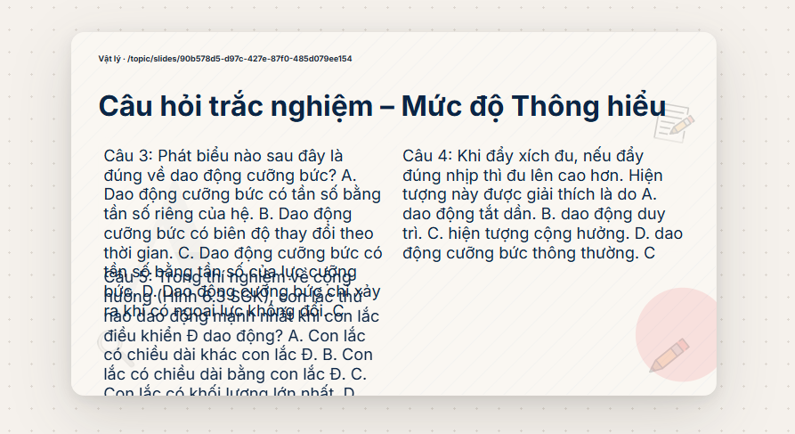

1, Chưa có các slide tiêu đề

Giải pháp đề xuất:

- Bắt buộc outline tạo một slide `section` ở đầu mỗi phần/chương, có `sectionTitle` riêng.
- Slide này hiển thị rõ tên phần và mục tiêu ngắn; không dùng chung cơ chế header mờ/ẩn.

2, Slide vẫn còn tiêu đề thừa

Giải pháp đề xuất:

- Quy định header chỉ chứa thông tin cấp bộ slide (ví dụ: môn học · tên bài).
- Tiêu đề từng slide chỉ xuất hiện một lần tại vùng hero/body.
- Với slide bìa và slide chuyển phần, không tạo thêm block nội dung trùng với tiêu đề slide.

3, Phần chữ chưa dàn đều ra giữa các slide, có slide ít nội dung có slide nhiều nội dung

Giải pháp đề xuất:

- Thêm ngân sách mật độ cho mỗi slide ngay từ lúc tạo outline: số ý chính, số ký tự, bảng/bước/công thức tối đa.
- Sau khi sinh nội dung, tách slide quá tải theo đơn vị ngữ nghĩa; gộp slide quá nhẹ với slide liên quan hoặc chuyển thành slide chuyển phần/hình minh hoạ.
- Không dùng việc giảm font để bù cho nội dung phân bổ không đều.

4, thỉnh thoảng vẫn còn slide trống, ko có nội dung mà ko báo lỗi

Giải pháp đề xuất:

- Trước khi báo hoàn tất, kiểm tra slide thường phải có ít nhất một nội dung chữ hoặc hình hợp lệ.
- Slide bìa/slide chuyển phần phải có tiêu đề hợp lệ.
- Nếu không đạt điều kiện, đánh dấu slide lỗi, hiển thị nguyên nhân và cho phép sinh lại riêng slide đó; không được báo hoàn tất thành công.

5, Vẫn có đè nhau. vấn đề này đề xuất việc giảm font chữ / kết hợp với việc dàn đều lượng dữ liệu giữa các slide ở trên

Giải pháp đề xuất:

- Sau khi điền nội dung, kiểm tra va chạm giữa các phần tử, chữ vượt khung và phần tử vượt canvas.
- Khi phát hiện lỗi, ưu tiên rút gọn/tách nội dung hoặc đổi bố cục; chỉ giảm font ở bước cuối cùng và không thấp hơn ngưỡng dễ đọc.
- Kết hợp với việc cân bằng nội dung ở vấn đề 3 để tránh chồng lấn từ gốc.

6, require ảnh phải có tỉ lệ đẹp, tức là vuông vuông chứ ko đc 1 thanh dài

Giải pháp đề xuất:

- Quy định các khung ảnh trong layout dùng tỉ lệ gần vuông hoặc ngang vừa phải, ưu tiên 1:1, 4:3 hoặc 3:2; không tạo khung ảnh dạng thanh dài.
- Truyền `preferredAspectRatio` cho từng ảnh vào bước sinh ảnh, đồng thời dùng `object-fit: cover` để ảnh lấp đầy khung mà không bị méo.
- Nếu ảnh nguồn không phù hợp, crop vào vùng trọng tâm hoặc chuyển sang layout khác thay vì kéo giãn ảnh.
