# Add Student — Flow

> Chuc nang Teacher them hoc sinh vao lop minh so huu bang Gmail: them thu cong tung email hoac import file CSV/Excel (UC-36, alias "Enroll Student").
> API spec: [`../API_designs/add-student.md`](../API_designs/add-student.md). Ke thua CRUD lop o [`../class-management/class-flow.md`](../class-management/class-flow.md). Kien truc theo [`../layered-architecture.md`](../layered-architecture.md).

## Current implementation note — 2026-08-05

- Khong con dung "hoc sinh Active/Inactive" theo `AppUser.status` de quan ly thanh vien lop. `AppUser.status` chi con la trang thai account-level; membership cua lop dung `class_members.status = ENROLLED | REMOVED`.
- Gmail moi khi Add Student se tao hoc sinh moi trong DB, gan `Role.STUDENT`, roi enroll vao lop. Gmail da ton tai phai la `STUDENT` va thong tin ho so nhap vao phai khop ho so dang luu.
- Neu Gmail dung nhung ho so sai, backend tra `409 PROFILE_MISMATCH`; FE hien thong bao yeu cau giao vien nhap dung thong tin, khong co buoc "xac nhan dung ho so cu".
- Xoa hoc sinh khoi lop la soft-remove membership (`ENROLLED -> REMOVED`), giu account, role, bai nop, file, comment/dong gop va lich su. Add lai hoc sinh da bi go khoi lop se reactivate membership cu (`REMOVED -> ENROLLED`).
- Import CSV/XLS/XLSX theo all-or-nothing: neu bat ky dong nao thieu/sai thong tin, trung Gmail, role conflict, account disabled, profile mismatch, da co trong lop, hoac vuot si so thi khong ghi bat ky hoc sinh nao; response tra danh sach `errors[]` theo dong de giao vien sua file va nop lai.

## 1. Nguyen tac

- **Nguon chinh la SRS**: chuc nang nay bao phu dung `UC-36 Add Student`, khong lam `UC-37 Remove Student` (xem "Diem mo").
- **Teacher-only, owner + Active**: chi class owner moi them duoc hoc sinh, va chi khi lop dang `ACTIVE` (`BR-34`, `BR-37`) — ke thua nguyen tac tu `class-management/class-flow.md`.
- **Them 1 email = ghi ngay, khong batch**: khac voi import, them 1 hoc sinh la 1 transaction don, thanh cong hoac loi ro rang cho tung buoc.
- **Import all-or-nothing**: validate toan bo file truoc, neu co bat ky dong loi nao thi khong ghi bat ky hoc sinh nao; tra danh sach loi theo dong de giao vien sua file va nop lai.
- **Tai khoan hoc sinh duoc cap qua Gmail, khong tu dang ky**: neu Gmail chua ton tai, Teacher tao hoc sinh moi trong luc Add Student; neu Gmail da ton tai, ho so nhap vao phai khop ho so hoc sinh dang luu.
- **Mot hoc sinh o nhieu lop**: enrollment check theo `(class_id, student_id)`, khong phai theo email toan he thong — mot Gmail co the la thanh vien cua nhieu lop khac nhau.
- **Gioi han si so 60 thanh vien/lop**: rule bo sung theo yeu cau du an, **khong co trong SRS goc**. Kiem tra o tang service bang `countByClassId`, khong phai DB constraint.
- **Cot file bat buoc ten la `gmail`** (khong phan biet hoa/thuong), khong phai `email` chung chung — cung la rule bo sung theo yeu cau du an, sieu chinh xac hon cach SRS mo ta "required email column".

## 2. Mapping SRS

| SRS | Ten | Mo ta trong flow |
|-----|-----|------------------|
| UC-36 | Add Student | Teacher them hoc sinh vao lop bang Gmail, thu cong hoac import file |
| BR-04 | Sign-in required | Teacher phai dang nhap moi thao tac duoc |
| BR-06 | Grant access | Chi tai khoan duoc cap quyen (co dong bo hang trong `app_users`) va dang `Active`/`Invited` moi dang nhap duoc |
| BR-34 | Class access/ownership | Chi owner moi quan ly membership cua lop |
| BR-37 | Inactive read-only | Lop Inactive chan moi thao tac ghi, gom ca thay doi membership |
| BR-38 | Import validate loi theo dong | Import file phai sach truoc khi ghi; dong loi duoc bao theo dong va khong ghi DB |
| BR-45 | Xoa/remove giu submission | Lien quan UC-37 (Remove Student), ngoai pham vi flow nay, chi ghi chu de tranh nham lan khi thiet ke Remove sau nay |
| BR-46 | Notification khi them | Moi hoc sinh them thanh cong nhan 1 thong bao class-enrollment |

## 3. Luong chinh

### 3.1. Teacher them 1 hoc sinh bang Gmail (`POST /api/classes/{id}/members`)

```text
Teacher                         Backend                              Database
  |                                |                                     |
  | POST /api/classes/{id}/members|                                     |
  | { email }                     |                                     |
  |------------------------------->                                    |
  |                                | load class, verify owner            |
  |                                | verify status = ACTIVE (BR-37)      |
  |                                | validate email required + format    |
  |                                |   (MSG02 / MSG03 neu sai)           |
  |                                | check si so lop < 60 (countByClassId)|
  |                                |------------------------------------->
  |                                | so luong hien tai                    |
  |                                <-------------------------------------|
  |                                | du 60? -> 409, dung tai day          |
  |                                | resolve-or-create AppUser theo email|
  |                                |------------------------------------->
  |                                | AppUser (moi hoac da ton tai)       |
  |                                <-------------------------------------|
  |                                | neu role khac STUDENT / DISABLED    |
  |                                |   -> 409, dung tai day              |
  |                                | check da enrolled (class_id,        |
  |                                |   student_id)                       |
  |                                |------------------------------------->
  |                                | ton tai? -> 409 "already enrolled"  |
  |                                <-------------------------------------|
  |                                | INSERT class_members                |
  |                                | assign Role.STUDENT (replaceRole)   |
  |                                |------------------------------------->
  |                                | member moi                          |
  |                                <-------------------------------------|
  |                                | tao Notification + recipient        |
  |                                | publish qua NotificationStreamPort  |
  |                                |------------------------------------->
  |<-------------------------------|                                     |
  | 201 ClassMemberDto (MSG08)    |                                     |
```

- Buoc "resolve-or-create AppUser" la nhanh quyet dinh quan trong nhat, xem chi tiet 3.1.1.
- Loi validate email (MSG02/MSG03) dung ngay truoc khi cham database, khong tao ban ghi nao.
- Check si so lop dat **truoc** buoc resolve-or-create AppUser — neu lop da du 60, khong tao `AppUser` moi khong can thiet, dung luon voi `409`.
- Notification gui **sau khi** commit thanh cong member — neu insert `class_members` that bai, khong gui notification (khop postcondition SRS).

#### 3.1.1. Nhanh resolve-or-create AppUser theo email

```text
email input
  |
  v
AppUserRepository.findByEmail(email)
  |
  +-- khong ton tai --> tao AppUser moi (status=ACTIVE, subject=null)
  |                     --> assign Role.STUDENT
  |                     --> dung id moi cho buoc enrollment
  |
  +-- ton tai --> status == DISABLED?
                    |
                    +-- co --> 409 "Tai khoan da bi khoa, lien he quan tri vien." (dung lai, khong sua status)
                    |
                    +-- khong --> role hien tai khac STUDENT va khac rong?
                                    |
                                    +-- co --> 409 "Email nay da duoc cap cho vai tro khac." (khong ghi de role)
                                    |
                                    +-- khong (STUDENT hoac chua co role) --> dung lai user id,
                                                                              assign/giu Role.STUDENT (idempotent)
```

- Nhanh nay dung chung cho ca `POST /members` (endpoint 3.1) va tung dong trong `POST /members/import` (endpoint 3.2).
- `assign Role.STUDENT` goi `UserRoleRepository.replaceRole(userId, Role.STUDENT, teacherId, now)` — an toan vi chi chay khi role hien tai la STUDENT hoac chua co, khong bao gio ghi de role khac.

### 3.2. Teacher import hoc sinh tu file (`POST /api/classes/{id}/members/import`)

```text
Teacher                         Backend                              Database
  |                                |                                     |
  | POST .../members/import       |                                     |
  | multipart file (.csv/.xlsx)   |                                     |
  |------------------------------->                                    |
  |                                | load class, verify owner            |
  |                                | verify status = ACTIVE (BR-37)      |
  |                                | validate file type/size/co cot "gmail"|
  |                                |   (khong phan biet hoa/thuong)      |
  |                                |   sai -> 400 MSG24, dung, khong ghi |
  |                                | doc si so hien tai cua lop           |
  |                                |   (countByClassId) lam moc dem      |
  |                                | parse tung dong THEO THU TU          |
  |                                | for each row:                       |
  |                                |   - sai dinh dang -> skip            |
  |                                |     reason=INVALID_FORMAT           |
  |                                |   - trung trong file -> skip         |
  |                                |     reason=DUPLICATE_IN_FILE        |
  |                                |   - si so hien tai + so da them      |
  |                                |     trong lan import >= 60 -> skip   |
  |                                |     reason=CLASS_FULL (khong xet     |
  |                                |     tiep cac buoc ben duoi)          |
  |                                |   - resolve-or-create AppUser        |
  |                                |     (nhanh 3.1.1)                   |
  |                                |     role conflict -> skip            |
  |                                |       reason=ROLE_CONFLICT          |
  |                                |     disabled -> skip                 |
  |                                |       reason=ACCOUNT_DISABLED       |
  |                                |   - da enrolled -> skip              |
  |                                |     reason=ALREADY_ENROLLED         |
  |                                |   - hop le -> gom vao batch insert,  |
  |                                |     tang bo dem "so da them"         |
  |                                | BEGIN TRANSACTION bulk insert        |
  |                                |------------------------------------->
  |                                | loi he thong giua chung?             |
  |                                |   co -> ROLLBACK toan bo,            |
  |                                |         500/502 MSG25, khong gui     |
  |                                |         notification nao            |
  |                                |   khong -> COMMIT                    |
  |                                <-------------------------------------|
  |                                | gui notification cho tung hoc sinh   |
  |                                | them thanh cong (BR-46)              |
  |                                |------------------------------------->
  |<-------------------------------|                                     |
  | 200 ImportStudentsResponse    |                                     |
  | { addedCount, createdCount,   |                                     |
  |   rejoinedCount, errorCount,  |                                     |
  |   errors: [...] }             |                                     |
```

- Neu co **bat ky dong nao loi**, van tra `200` voi `addedCount = 0`, `errorCount > 0` va danh sach `errors` day du; khong ghi bat ky hoc sinh nao.
- Rollback toan bo **chi** ap dung cho loi he thong trong luc ghi bulk (vd. mat ket noi DB giua chung) — khong ap dung cho dong bi skip do validate hoac do vuot si so (day la hanh vi binh thuong cua `BR-38`, ap dung tuong tu cho gioi han 60).
- File sai dinh dang/rong/qua gioi han bi chan tu buoc dau, khong parse dong nao, khong tao ban ghi nao (MSG24). File dung ten cot khac (vd. `email` thay vi `gmail`) cung bi coi la thieu cot bat buoc, chan tu buoc nay.
- Moc dem si so (`countByClassId` + so dong da them trong lan import) duoc tinh **tang dan theo thu tu dong trong file** — dong nao khien tong vuot 60 thi tu dong do tro di deu bi skip `CLASS_FULL`, ke ca khi cac dong sau no thuc ra hop le neu xet rieng.

### 3.3. Hoc sinh dang nhap lan dau sau khi duoc them

```text
Student (Google)                Backend (AuthService.loginWithGoogle)
  |                                |
  | POST /api/auth/google         |
  | { idToken }                   |
  |------------------------------->
  |                                | verify Google idToken
  |                                | tim AppUser theo email (da co tu
  |                                |   buoc Add Student, status=ACTIVE)
  |                                | cap nhat googleSub/lastLoginAt
  |                                | roles = { STUDENT } (tu buoc 3.1.1)
  |                                | issue JWT (role primary = STUDENT)
  |<-------------------------------|
  | 200 { accessToken, ... }      |
```

- Khong thay doi logic `AuthService.loginWithGoogle` hien co — luong nay hoat dong dung ngay khi `Role.STUDENT` duoc them va `class_members`/`user_roles` da co ban ghi tu buoc Add Student. Chi tiet dang nhap xem `auth.md`.
- Neu buoc Add Student **khong** gan `Role.STUDENT` (bo sot), `JwtTokenAdapter.issueAccessToken` se throw vi `Role.primaryOf(roles)` nhan tap rong — day chinh la ly do bat buoc phai gan role ngay trong luc them hoc sinh, khong de danh sau.

## 4. So do tong quan

```mermaid
flowchart TD
    activeHub["Class Hub - ACTIVE (tu class-management flow)"] --> members["Class Members screen"]
    members --> addOne["Add Student - 1 email"]
    members --> importMany["Import Students - file"]

    addOne --> checkCapacity{"Lop du 60 thanh vien?"}
    checkCapacity -- "Roi" --> full409["409 Class full"]
    checkCapacity -- "Chua" --> resolveUser{"Email da ton tai?"}
    resolveUser -- "Khong" --> createUser["Tao AppUser moi, ACTIVE"]
    resolveUser -- "Co, role != STUDENT" --> conflict409["409 Role conflict"]
    resolveUser -- "Co, DISABLED" --> disabled409["409 Account disabled"]
    resolveUser -- "Co, STUDENT/chua co role" --> reuseUser["Dung lai AppUser"]
    createUser --> checkEnrolled{"Da enrolled lop nay?"}
    reuseUser --> checkEnrolled
    checkEnrolled -- "Roi" --> dup409["409 Already enrolled"]
    checkEnrolled -- "Chua" --> insertMember["Insert class_members + assign STUDENT"]
    insertMember --> notify["Gui notification (BR-46)"]
    notify --> memberAdded["201 - Student added"]

    importMany --> validateFile{"File hop le + co cot gmail?"}
    validateFile -- "Khong" --> fileError["400 MSG24 - khong them ai"]
    validateFile -- "Co" --> parseRows["Phan loai tung dong (bao gom CLASS_FULL khi vuot 60)"]
    parseRows --> bulkInsert["Bulk insert dong hop le trong gioi han 60"]
    bulkInsert -- "Loi he thong" --> rollback["Rollback toan bo - MSG25"]
    bulkInsert -- "Thanh cong" --> importSummary["200 - Import summary (added/errors)"]
    importSummary --> notifyEach["Gui notification cho tung hoc sinh them thanh cong"]

    memberAdded --> studentLogin["Hoc sinh dang nhap Google lan dau"]
    notifyEach --> studentLogin
    studentLogin --> loggedIn["JWT role=STUDENT - vao duoc Class Hub"]
```



## 5. Model du lieu du kien

### `class_members` (theo dung `ClassMemberEntity` UUID, khong theo `V15__create_class_management.sql` cu)

```sql
-- Luu y: V15__create_class_management.sql hien tai tao classes/class_members bang
-- BIGSERIAL + teacher_id/student_id BIGINT REFERENCES users(id), lech voi ClassEntity/
-- ClassMemberEntity (JPA) dang dung UUID + owner_id/app_users. spring.jpa.hibernate.ddl-auto=update
-- dang che giau lech nay. Migration phuc vu Add Student PHAI theo schema duoi day (khop entity
-- thuc te), khong theo V15 cu — can 1 migration sua lai truoc khi trien khai UC-36.

CREATE TABLE class_members (
  id UUID PRIMARY KEY,
  class_id UUID NOT NULL REFERENCES classes(id) ON DELETE CASCADE,
  student_id UUID NOT NULL REFERENCES app_users(id),
  joined_at TIMESTAMPTZ NOT NULL DEFAULT now(),
  UNIQUE (class_id, student_id)
);

CREATE INDEX idx_class_members_class_id ON class_members (class_id);
CREATE INDEX idx_class_members_student_id ON class_members (student_id);
```

- Khong can bang moi rieng cho "import batch/history" — SRS chi yeu cau tra import summary trong response, khong yeu cau luu lich su import.
- `Role.STUDENT` moi trong `user_roles` dung lai bang hien co (`replaceRole`), khong can bang moi.
- Gioi han si so 60/lop **khong luu trong DB** (khong them cot/CHECK constraint) — dung `COUNT(*) FROM class_members WHERE class_id = ?` (`ClassMemberRepository.countByClassId` da co san) tai thoi diem xu ly request; hang so `60` de xuat cau hinh qua Java constant/`application.properties` de doi duoc ma khong can migration.

## 6. Layered mapping

```text
domain/model/auth/                Role (them STUDENT + PRIORITY)
domain/model/classroom/           ClassMember (da co, khong doi)
repository/repositories/          ClassMemberRepository (them findByClassId)
                                   AppUserRepository, UserRoleRepository (dung lai)
repository/gateways/               NotificationStreamPort (dung lai)
                                   NotificationRepository (dung lai)
infrastructure/persistence/       ClassMemberEntity (da co, khong doi)
service/classroom/                ClassEnrollmentService (moi)
presentation/dto/classroom/       AddStudentRequest, ClassMemberDto,
                                   ClassMemberPageDto, ImportStudentsResponse
presentation/controller/          ClassController (them 3 method: GET/POST members,
                                   POST members/import)
```

- `ClassEnrollmentService` la service moi, tach khoi `ClassManagementService` (giu single-responsibility: mot ben quan ly CRUD lop, mot ben quan ly membership) nhung dung chung `ClassRepository`/`ClassMemberRepository` de kiem tra owner/status.
- Controller mong: nhan request, goi `ClassEnrollmentService`, tra response — khong xu ly business rule trong controller.
- HTTP status va message code mapping nam o `presentation` (controller + `GlobalExceptionHandler`), khong nam trong service.

## 7. Loi va rule can xu ly

| Tinh huong | Ket qua |
|------------|---------|
| User khong phai Teacher goi bat ky endpoint members nao | `403` |
| User khong phai owner/enrolled student goi `GET /members` | `403` |
| Teacher khong phai owner goi `POST /members` hoac `/members/import` | `403` |
| Lop khong ton tai | `404` |
| Lop dang `INACTIVE` khi goi `POST /members` hoac `/members/import` | `403` (MSG23) |
| Thieu email khi Add Student | `400` (MSG02) |
| Email sai dinh dang khi Add Student | `400` (MSG03) |
| Email da la role khac STUDENT (TEACHER/MODERATOR/PRINCIPAL/IT_STAFF) | `409` |
| Email dang `DISABLED` | `409` |
| Hoc sinh da enrolled trong lop nay | `409` |
| Lop da du 60 thanh vien, goi `POST /members` them 1 hoc sinh moi | `409` |
| File import sai dinh dang/rong/vuot gioi han/thieu cot `gmail` (vd file dung cot `email`) | `400` (MSG24), khong them ai |
| File import co dong hop le nhung lop se vuot 60 neu them dong do | dong do va cac dong sau bi skip `CLASS_FULL`, cac dong truoc van duoc them binh thuong |
| File import co bat ky dong loi nao | `200`, `addedCount=0`, `errorCount>0`, `errors` day du ly do; khong ghi DB |
| Loi he thong giua qua trinh ghi bulk import | rollback toan bo, `500`/`502` (MSG25), khong gui notification |
| Notification gateway loi sau khi da commit member | member van duoc giu (khong rollback vi da commit); ghi log loi rieng, khong chan response thanh cong |

## 8. Acceptance checklist

- Teacher them 1 email hop le, chua enrolled → thanh cong, xuat hien trong `GET /members`, hoc sinh nhan duoc notification.
- Teacher them lai email da enrolled trong cung lop → chan `409`, `class_members` khong doi.
- Teacher them email dang la Teacher/Moderator khac → chan `409`, role cua tai khoan do khong bi doi.
- Teacher them email dang `DISABLED` → chan `409`, tai khoan van `DISABLED`.
- Teacher them khi lop `INACTIVE` → chan `403` MSG23, khong tao ban ghi nao.
- Lop da co dung 60 thanh vien, Teacher them 1 hoc sinh moi hop le → chan `409`, si so khong doi.
- Import file co cot ten `Email` (khong phai `gmail`) → tu choi ca file `400` MSG24, khong them ai.
- Import file co bat ky dong loi nao (sai dinh dang, trung, da enrolled, sai ho so, vuot si so) → khong ghi DB, tra `errors[]` theo dong.
- Import file sai dinh dang/qua gioi han → chan `400` MSG24, khong them ai.
- Lop dang co 55 thanh vien, import file co 10 dong hop le → chi them du 5 dong dau (cho toi 60), 5 dong con lai bi skip `CLASS_FULL`, summary phan anh dung so lieu nay.
- Import that bai giua chung do loi he thong → rollback toan bo, khong ai duoc them, khong notification nao duoc gui.
- Hoc sinh moi duoc them dang nhap Google lan dau thanh cong, JWT co `role=STUDENT`, vao duoc Class Hub cua lop vua duoc them.

## 9. Diem mo

- `UC-37 Remove Student` — thiet ke API + flow rieng, ke thua cung `ClassMemberRepository`; luu y `BR-45` (remove giu lai submission).
- UI Class Members / Add Student / Import Students o FE — chua ton tai, thiet ke sau khi API duoc chot.
- Gioi han **kich thuoc file** va **so dong toi da** cho import (rieng voi gioi han si so 60 thanh vien/lop da chot o tren) — SRS chua neu con so cu the, can Product xac nhan.
- Kha nang multi-role thuc su (1 tai khoan vua Teacher vua Student) — ngoai pham vi SRS hien tai, hien dang chan boi rule "role conflict".
