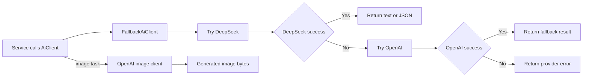
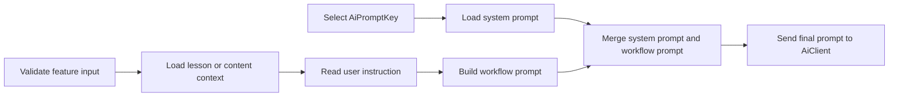
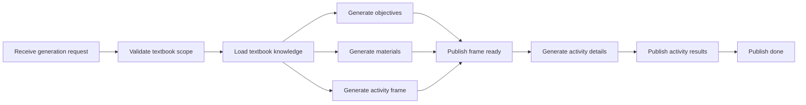
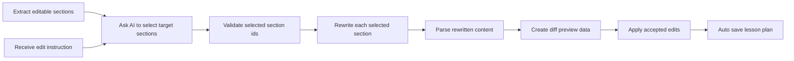
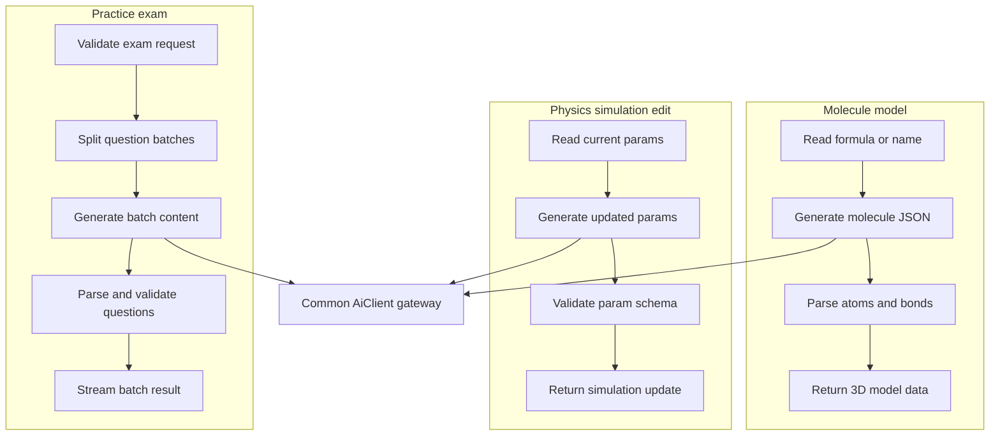
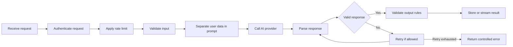

# AI Workflow Diagrams

This file contains simple block-style Mermaid diagrams for the AI workflow section in Report 4. The diagrams avoid actor-based workflows and focus on program activities connected by processing steps.

## 1. Overall AI Processing Blocks

**Diagram type:** High-level activity block diagram  
**Goal:** Show the main program blocks used whenever an AI feature runs.

```mermaid
flowchart LR
    A["Frontend request"]
    B["Backend REST controller"]
    C["Service use case"]
    D["Prompt builder"]
    E["AiClient gateway"]
    F["AI provider"]
    G["Response parser"]
    H["Output validator"]
    I["Database or storage"]
    J["Frontend result view"]

    A --> B --> C --> D --> E --> F --> G --> H --> I --> J
```

## 2. AI Provider Selection Blocks

**Diagram type:** Provider fallback block diagram  
**Goal:** Show how the backend chooses the provider through the gateway.

## 3. Prompt Construction Blocks

**Diagram type:** Prompt construction block diagram  
**Goal:** Show how system prompts and runtime context become the final AI prompt.

## 4. Lesson Plan Generation Blocks

**Diagram type:** Generation pipeline block diagram  
**Goal:** Show the two-phase lesson-plan generation process.

## 5. Lesson Section AI Edit Blocks

**Diagram type:** AI edit block diagram  
**Goal:** Show the two-step edit logic without UI actor details.

## 6. Slide Generation and Design Blocks

**Diagram type:** Slide pipeline block diagram  
**Goal:** Show the main slide-generation program steps from lesson plan to final deck.

```mermaid
flowchart LR
    A["Lesson plan input"]
    B["Chunk lesson content"]
    C["Generate deck blueprint"]
    D["Generate part skeletons"]
    E["Expand parts and slides"]
    F["Consolidate deck outline"]
    G["Confirm outline"]
    H["Generate deck skin"]
    I["Run layout engine"]
    J["Fill content slots"]
    K["Generate image slots"]
    L["Store image assets"]
    M["Build final slide deck"]

    A --> B --> C --> D --> E --> F --> G --> H --> I --> J --> M
    J --> K --> L --> M
```

## 7. Other AI Feature Blocks

**Diagram type:** Feature grouping block diagram  
**Goal:** Show smaller AI workflows that reuse the same backend gateway pattern.

## 8. AI Reliability and Safety Blocks

**Diagram type:** Control block diagram  
**Goal:** Show the control steps around every AI call.

