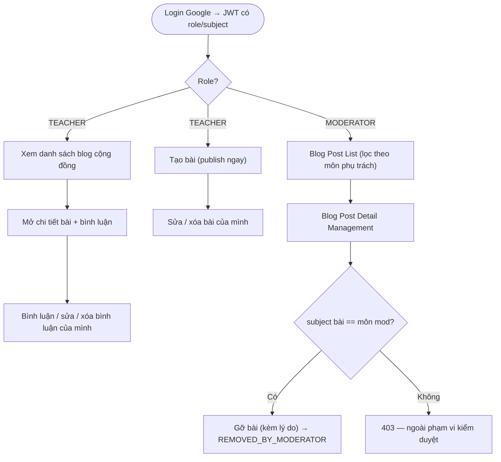

# Blog — Luồng & thiết kế triển khai (BE)

> Blog cộng đồng giáo viên: chia sẻ bài viết, bình luận; Moderator kiểm duyệt theo môn.
> Spec API: [`../API_designs/blog.md`](../API_designs/blog.md). Kiến trúc theo [`../layered-architecture.md`](../layered-architecture.md).

## 1. Nguyên tắc

- **Đăng trực tiếp, không duyệt** (BR-20): tạo bài = publish ngay (khác Community Hub có review queue).
- **Mỗi bài gắn đúng 1 `subject`** (BR-20), dùng lại enum `Subject {MATH, CHEMISTRY, PHYSICS}` — cho search/filter và ranh giới kiểm duyệt.
- **Moderator gỡ theo môn + lý do** (BR-21): chỉ gỡ bài `subject` khớp môn phụ trách, bắt buộc `reason`.
- **Cộng đồng tự điều tiết qua comment** (BR-22): chưa có like/vote/report.
- **Owner-only** (BR-16): chỉ tác giả sửa/xóa bài & bình luận của mình.
- **Không real-time / không STOMP**: mọi thao tác là REST đồng bộ; blog không có AI generation. FE tự refetch.
- **Editor = đúng như lesson-plan**: soạn bằng TipTap 3 (`createEditorExtensions`), lưu **HTML**; BE sanitize trước khi lưu.

## 2. Luồng

### 2.1. Tạo bài (`POST /api/blog-posts`)
```
FE (TipTap editor.getHTML) ── { title, content, subject } ──▶ POST /api/blog-posts
                                                               │  @PreAuthorize hasRole('TEACHER')
BE:  validate title/subject; sanitize(content) [Jsoup]         │  rỗng sau sanitize → 400
       │
       ▼
     BlogPost{ authorId=current, status=PUBLISHED, createdAt=now }  → BlogPostRepository.save
       ▼
     201 BlogPostDetailDto        (publish ngay — BR-20)
```

### 2.2. Sửa / Xóa bài của mình (owner-only, BR-16)
```
PATCH /api/blog-posts/{id}    → load post; post.authorId ≠ current → 403
                                sanitize(content mới); update; 200
DELETE /api/blog-posts/{id}   → load post; owner check; status = DELETED_BY_AUTHOR (soft); 204
```

### 2.3. Moderator gỡ bài (`POST /api/blog-posts/{id}/removal`, BR-21)
```
{ reason } ──▶ removal                       @PreAuthorize hasRole('MODERATOR')
   │ reason rỗng → 400
   ▼
 load post (PUBLISHED)  → 404 nếu không có
   │ post.subject ≠ claims.subject → 403   (subject-match — BR-21)
   ▼
 status = REMOVED_BY_MODERATOR; removed_reason = reason; removed_by = moderatorId; 204
   ▼
 (follow-up) notify tác giả kèm lý do
```

### 2.4. Bình luận (BR-22)
```
POST   /api/blog-posts/{id}/comments  { content }  → 201 BlogCommentDto  (bài phải PUBLISHED)
PATCH  /api/blog-comments/{commentId} { content }  → owner check → 200
DELETE /api/blog-comments/{commentId}              → owner check → 204 (hard delete)
```

### 2.5. Đọc (List / Detail)
```
GET /api/blog-posts            → chỉ status=PUBLISHED; filter subject/authorId=me/q; phân trang
GET /api/blog-posts/{id}       → BlogPostDetailDto (content HTML + comments); không PUBLISHED → 404
```

### 2.6. Sơ đồ tổng quan


## 3. Model dữ liệu (Flyway `V3__create_blog.sql`)

- **`blog_posts`**
  - `id uuid pk`, `author_id uuid not null → app_users(id)`
  - `title varchar(255) not null`, `content text not null` (HTML đã sanitize)
  - `subject varchar(20) not null`  — MATH | CHEMISTRY | PHYSICS (reuse enum `Subject`)
  - `status varchar(20) not null default 'PUBLISHED'` — PUBLISHED | REMOVED_BY_MODERATOR | DELETED_BY_AUTHOR
  - `removed_reason text null`, `removed_by uuid null → app_users(id)`
  - `created_at timestamptz not null default now()`, `updated_at timestamptz not null default now()`
  - Index: `(subject)`, `(author_id)`, `(status, created_at)`
- **`blog_comments`**
  - `id uuid pk`, `post_id uuid not null → blog_posts(id)`, `author_id uuid not null → app_users(id)`
  - `content text not null`
  - `created_at timestamptz not null default now()`, `updated_at timestamptz not null default now()`
  - Index: `(post_id)`

## 4. Layered mapping (khớp `layered-architecture.md`)

```
domain/model/blog/          BlogPost, BlogComment, BlogPostStatus   (reuse domain.model.auth.Subject)
repository/repositories/     BlogPostRepository, BlogCommentRepository        (interface — service-facing)
infrastructure/persistence/  BlogPostEntity, BlogCommentEntity
                             + repository/BlogPostJpaRepository, BlogCommentJpaRepository (Spring Data)
                             + JpaBlogPostRepository, JpaBlogCommentRepository (adapter impl interface)
service/blog/                BlogPostService, BlogCommentService   (owner-check, subject-match, sanitize)
presentation/controller/     BlogController
presentation/dto/blog/       CreateBlogPostRequest, UpdateBlogPostRequest, RemoveBlogPostRequest,
                             CreateBlogCommentRequest, BlogPostSummaryDto, BlogPostDetailDto, BlogCommentDto
```
- Theo đúng pattern auth: entity `AppUserEntity` ↔ adapter `JpaAppUserRepository` ↔ interface `AppUserRepository`.
- Constructor injection; controller mỏng; owner/subject rule ở service; HTTP status ở controller/advice.

## 5. RBAC (SEC-04)

- `@PreAuthorize("hasRole('TEACHER')")`: create/edit/delete bài + create/edit/delete comment.
- `@PreAuthorize("hasRole('MODERATOR')")`: `POST /removal`.
- `authenticated()`: list + detail (cả 2 role đọc được).
- **Owner-only** (BR-16): service so `resource.authorId` với `CurrentUserProvider.requireUserId()`.
- **Moderator subject-match** (BR-21): service so `post.subject` với `CurrentUserProvider.require().subject()`.

## 6. Editor & Sanitize

- Blog dùng **đúng editor lesson-plan**: `fe/components/LessonEditor/editorConfig.ts` → `createEditorExtensions`
  (StarterKit, TextStyleKit, Highlight, TextAlign, Sub/Superscript, TableKit, Image, Mathematics/KaTeX, ParagraphClass).
  Không dùng node streaming lesson-specific (PendingActivity/PendingSection).
- Nội dung trao đổi = **HTML** (`editor.getHTML()`); FE read-view render bằng cùng extension set để bảng/ảnh/công thức hiển thị đúng.
- **BE sanitize (Jsoup)** allowlist khớp output editor, giữ `data-latex` cho KaTeX:
  - Tags: `p`(class), `h1 h2 h3`, `b strong i em u s`, `a`(href, rel, target), `ul ol li`,
    `table thead tbody tr th td`, `img`(src, alt), `sub`, `sup`.
  - Math: `span[data-type=inline-math][data-latex]`, `div[data-type=block-math][data-latex]`.
  - `style` cho `text-align`, `color`, `background-color`, `font-size`, highlight.
  - Loại `script`, `on*`, `javascript:` — chống XSS (SEC).
- Ảnh: upload qua `POST /api/uploads` (R2) → chèn URL vào `` (xem `../API_designs/api-chung.md`).

## 7. Tài khoản test

- Không cần seed tạm Teacher/Moderator cho blog nữa.
- Principal đăng nhập bằng tài khoản seed, cấp Moderator qua `/api/principal/moderators`.
- Moderator cấp Teacher cùng subject qua `/api/moderator/teachers`.
- Sau khi login Google bằng email đã được cấp quyền → JWT mang role + subject → FE điều hướng vào trang Blog theo role.

## 8. Cấu hình

Không cần cấu hình seed riêng cho blog. Dùng account management hiện có để cấp quyền trước khi test.

## 9. Thứ tự build (phase triển khai)

1. Flyway `V3__create_blog.sql` (`blog_posts`, `blog_comments`).
2. Domain (`BlogPost`, `BlogComment`, `BlogPostStatus`) + repository interfaces.
3. JPA entity + Spring Data repo + adapter (pattern `AppUserEntity`/`JpaAppUserRepository`).
4. `BlogPostService` / `BlogCommentService` (owner-check, subject-match, Jsoup sanitize).
5. `BlogController` + DTO + map lỗi ở `GlobalExceptionHandler`.
6. Cấp tài khoản qua account management (§7) + smoke test 9 endpoint bằng Teacher/Moderator cùng subject.
7. (Follow-up) FE màn Blog (list / detail / create / management); notification.

## 10. Điểm mở

- Notification cho tác giả khi bị gỡ bài / có comment mới (chờ hệ notification).
- Report/flag bài bởi cộng đồng (SRS hiện chỉ để Moderator tự phát hiện).
- Teacher đọc/comment bài **khác môn**: mặc định cho phép (khớp "đọc bài của giáo viên khác").
- FE screens theo ma trận Screen Authorization 1.4.2: Blog (list), Blog Detail Content, Create Blog Post (Teacher); Blog Post List, Blog Post Detail Management (Moderator).
