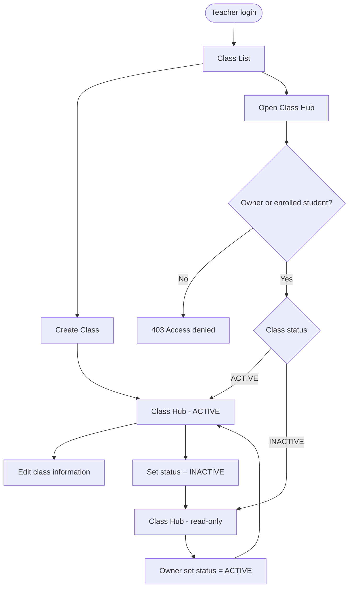

# Class Management — Flow

> Chuc nang Teacher quan ly lop hoc minh so huu: tao lop, xem danh sach/chi tiet lop, cap nhat thong tin lop, va deactivate/reactivate lop bang trang thai Active/Inactive.
> API spec: [`../API_designs/class-management.md`](../API_designs/class-management.md). Kien truc theo [`../layered-architecture.md`](../layered-architecture.md).

## 1. Nguyen tac

- **Nguon chinh la SRS**: chuc nang nay bao phu `UC-29` den `UC-33`.
- **Class Hub kieu Google Classroom**: lop la khong gian trung tam de xem thong tin lop, members, resources, assignments va submissions. Phase nay khong co class code/self-join.
- **Teacher owner**: Teacher tao lop se la owner; owner moi duoc quan ly settings theo `BR-34`.
- **Inactive = soft-delete/read-only**: deactivate lop bang `status = INACTIVE`, khong xoa ban ghi vat ly.
- **Giu du lieu cu**: Inactive class van cho owner va enrolled students view/download resource/submission cu theo `BR-39`.
- **Khong gom enrollment/resource API**: Add Student, Remove Student, Post Resource la cac use case rieng; flow nay chi hien thi summary trong Class Hub.

### Frontend Class Hub navigation

- `/class-detail?classId={id}` la trang **Tong quan**, hien class info va cac counter tu `ClassDetailDto`.
- Class Hub tach thanh cac man hinh `/class-detail/members`, `/resources`, `/assignments`, va `/settings`; tat ca giu `classId` tren query string.
- Submission roster va submission detail co route rieng duoi `/class-detail/assignments/` va truyen `resourceId`/`studentId` tren query string de deep-link.
- `/add-student?classId={id}` la URL tuong thich cu va redirect sang `/class-detail/members?classId={id}`.
- Hien tai cac man hinh Class Hub management chi cap cho `TEACHER` va `MODERATOR`; khong thay doi API hay quyen Student trong pham vi tach UI nay.

## 2. Mapping SRS

| SRS | Ten | Mo ta trong flow |
|-----|-----|------------------|
| UC-29 | View Class List | Teacher xem danh sach lop minh so huu, search/filter |
| UC-30 | Create Class | Teacher tao lop moi voi name, subject, grade, description tuy chon |
| UC-31 | Edit Class Information | Owner cap nhat name, description, subject, grade cua lop Active |
| UC-32 | Set Class Status | Owner chuyen lop giua Active va Inactive |
| UC-33 | View Class Detail | Owner hoac enrolled student mo Class Hub |
| BR-34 | Class access/ownership | Chi owner va enrolled students duoc vao Class Hub; chi owner quan ly |
| BR-37 | Inactive read-only | Inactive class chan cac thao tac ghi |
| BR-39 | Inactive view/download | Du lieu cu van xem/tai duoc khi Inactive |

## 3. Luong chinh

### 3.1. Teacher xem danh sach lop (`GET /api/classes`)

```text
Teacher                    Backend                         Database
  |                           |                                |
  | GET /api/classes          |                                |
  | ?q&subject&grade&status   |                                |
  |-------------------------->|                                |
  |                           | verify role = TEACHER          |
  |                           | filter owner_id = currentUser  |
  |                           |------------------------------->|
  |                           | classes owned by Teacher        |
  |<--------------------------|                                |
  | 200 page<ClassSummaryDto> |                                |
```

- Danh sach chi gom lop do Teacher hien tai so huu.
- Search/filter khong thay doi du lieu.
- Moi item hien thi name, subject, member count va Active/Inactive status.

### 3.2. Teacher tao lop (`POST /api/classes`)

```text
Teacher                         Backend                         Database
  |                                |                                |
  | POST /api/classes              |                                |
  | { name, subject, grade,        |                                |
  |   description? }               |                                |
  |------------------------------->|                                |
  |                                | validate required fields        |
  |                                | validate subject, grade         |
  |                                | owner_id = currentUser          |
  |                                | status = ACTIVE                 |
  |                                | INSERT classes                  |
  |                                |------------------------------->|
  |                                | new class                       |
  |<-------------------------------|                                |
  | 201 ClassDetailDto             |                                |
  | FE opens new Class Hub         |                                |
```

- Lop moi mac dinh `ACTIVE`.
- Teacher tao lop duoc gan lam owner.
- Member area va resource area cua Class Hub san sang nhung chua tu dong co student/resource.

### 3.3. User mo Class Hub (`GET /api/classes/{id}`)

```text
User                         Backend                         Database
  |                             |                                |
  | GET /api/classes/{id}       |                                |
  |---------------------------->|                                |
  |                             | load class                     |
  |                             | verify user is owner           |
  |                             |   OR enrolled student          |
  |                             | load hub summaries             |
  |                             |------------------------------->|
  |                             | class + counters               |
  |<----------------------------|                                |
  | 200 ClassDetailDto          |                                |
```

- Owner xem duoc class info, member summary, resource summary, assignment/submission summary.
- Student enrolled chi xem thong tin va action duoc phep theo role/status.
- Neu lop `INACTIVE`, hub van mo duoc nhung chi doc/view/download.

### 3.4. Teacher cap nhat thong tin lop (`PATCH /api/classes/{id}`)

```text
Teacher owner                    Backend                         Database
  |                                  |                                |
  | PATCH /api/classes/{id}          |                                |
  | { name?, subject?, grade?,       |                                |
  |   description? }                 |                                |
  |--------------------------------->|                                |
  |                                  | load class                     |
  |                                  | verify owner                   |
  |                                  | verify status = ACTIVE         |
  |                                  | validate changed fields        |
  |                                  | UPDATE classes                 |
  |                                  |------------------------------->|
  |                                  | updated class                  |
  |<---------------------------------|                                |
  | 200 ClassDetailDto               |                                |
```

- Sai owner tra `403`.
- Class khong ton tai tra `404`.
- Class `INACTIVE` tra `403` hoac domain error read-only map thanh message `MSG23`.
- Update class information khong lam thay doi members/resources/submissions.

### 3.5. Teacher deactivate/reactivate lop (`PATCH /api/classes/{id}/status`)

```text
Teacher owner                    Backend                         Database
  |                                  |                                |
  | PATCH /api/classes/{id}/status   |                                |
  | { status: INACTIVE | ACTIVE }    |                                |
  |--------------------------------->|                                |
  |                                  | load class                     |
  |                                  | verify owner                   |
  |                                  | validate target status         |
  |                                  | UPDATE classes.status          |
  |                                  |------------------------------->|
  |                                  | updated class                  |
  |<---------------------------------|                                |
  | 200 ClassDetailDto               |                                |
```

- `ACTIVE -> INACTIVE`: deactivate lop; Class Hub vao che do read-only.
- `INACTIVE -> ACTIVE`: reactivate lop; cac thao tac day hoc binh thuong duoc mo lai.
- Khong xoa resource/submission khi deactivate.
- Khong cung cap `DELETE /api/classes/{id}` trong phase nay de tranh hard-delete ngoai SRS.

## 4. So do tong quan



## 5. Model du lieu du kien

### `classes`

```sql
CREATE TABLE classes (
  id UUID PRIMARY KEY,
  owner_id UUID NOT NULL REFERENCES app_users(id),
  name VARCHAR(255) NOT NULL,
  description TEXT,
  subject VARCHAR(20) NOT NULL,
  grade INTEGER NOT NULL,
  status VARCHAR(20) NOT NULL DEFAULT 'ACTIVE',
  created_at TIMESTAMPTZ NOT NULL DEFAULT now(),
  updated_at TIMESTAMPTZ NOT NULL DEFAULT now()
);

CREATE INDEX idx_classes_owner_id ON classes(owner_id);
CREATE INDEX idx_classes_status ON classes(status);
CREATE INDEX idx_classes_subject ON classes(subject);
```

- `subject`: reuse enum domain `Subject { MATH, PHYSICS, CHEMISTRY }`.
- `grade`: chi nhan 10, 11, 12 theo scope THPT cua SRS.
- `status`: `ACTIVE | INACTIVE`.
- Enrollment, resources va submissions can bang rieng trong cac feature tiep theo.

## 6. Layered mapping

```text
domain/model/classroom/          Classroom, ClassStatus
repository/repositories/         ClassRepository
infrastructure/persistence/      ClassEntity
                                  + ClassJpaRepository
                                  + JpaClassRepository
service/classroom/               ClassManagementService
presentation/controller/         ClassController
presentation/dto/classroom/      CreateClassRequest, UpdateClassRequest,
                                  UpdateClassStatusRequest,
                                  ClassSummaryDto, ClassDetailDto
```

- Controller mong: nhan request, goi service, tra response.
- Service giu business rules: owner-only, participant access, Active/Inactive read-only.
- Repository interface nam o layer `repository`; JPA adapter nam o `infrastructure`.
- HTTP concerns va status code mapping nam o `presentation`.

## 7. Loi va rule can xu ly

| Tinh huong | Ket qua |
|------------|---------|
| User khong phai Teacher goi list/create/update/status | `403` |
| User khong phai owner/enrolled student mo Class Hub | `403` |
| Class khong ton tai | `404` |
| Required field thieu khi create | `400` |
| Subject/grade/status khong hop le | `400` |
| Owner edit class Inactive | `403` hoac read-only domain error |
| Owner set status trung trang thai hien tai | `400` |
| Save/load fail | `500` hoac error envelope chung |

## 8. Acceptance checklist

- Teacher tao class thanh cong va class moi co `status = ACTIVE`.
- Teacher chi thay class minh so huu trong `GET /api/classes`.
- Owner sua duoc class Active, khong sua duoc class Inactive.
- Owner deactivate class, du lieu cu van con va Class Hub van xem duoc.
- Owner reactivate class, cac write action lien quan co the duoc mo lai.
- Student enrolled mo duoc Class Hub; student khong enrolled bi chan.
- Khong co hard delete class trong CRUD phase nay.

## 9. Diem mo

- Enrollment APIs cho `UC-36 Add Student` va `UC-37 Remove Student`.
- Resource APIs cho `UC-38` den `UC-40`.
- Submission APIs cho `UC-44` tro di.
- Class code/self-join kieu Google Classroom neu sau nay SRS bo sung.
