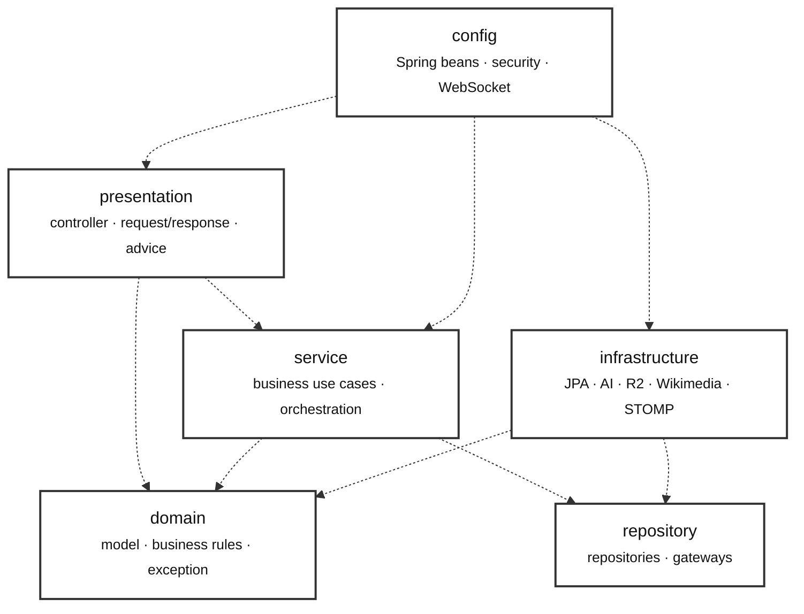
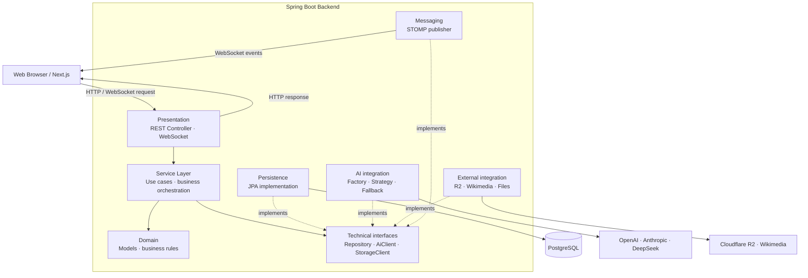
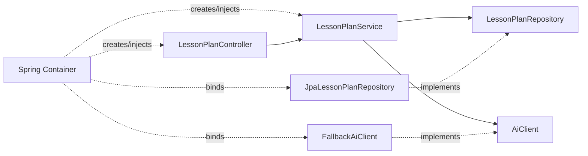

# Layered Architecture + Dependency Injection

Kiến trúc phân lớp tối giản cho Spring Boot. Mỗi tầng có một trách nhiệm rõ ràng, còn Spring Dependency Injection chịu trách nhiệm khởi tạo và kết nối các object.

## Package diagram

Mũi tên biểu thị package nguồn phụ thuộc vào package đích.



Dependency chính:

```text
presentation → service → domain
                    └──→ repository interface

infrastructure → repository interface / domain
config → lắp ráp các implementation bằng Spring DI
```

## System architecture



## Cấu trúc thư mục

```text
com.example.eduasystem
├── presentation/
│   ├── controller/
│   ├── dto/
│   └── advice/
│
├── service/
│   ├── experiment/
│   ├── lessonplan/
│   ├── simulation/
│   ├── slide/
│   └── model3d/
│
├── domain/
│   ├── model/
│   └── exception/
│
├── repository/
│   ├── repositories/
│   │   ├── ExperimentRepository.java
│   │   ├── LessonPlanRepository.java
│   │   └── Model3dRepository.java
│   └── gateways/
│       ├── AiClient.java
│       ├── StorageClient.java
│       └── MessagePublisher.java
│
├── infrastructure/
│   ├── persistence/
│   │   ├── entity/
│   │   ├── mapper/
│   │   └── repository/
│   ├── ai/
│   ├── storage/
│   ├── external/
│   └── messaging/
│
├── config/
└── EduaSystemApplication.java
```

## Giải thích các folder

### `presentation/`

Tầng nhận yêu cầu từ client và trả response.

Chứa:

- REST controller và WebSocket endpoint
- Request/response DTO
- Validation cú pháp đầu vào bằng `@Valid`
- `GlobalExceptionHandler`
- Mapping giữa HTTP DTO và dữ liệu service

Controller chỉ nên:

```text
nhận request → gọi service → trả response
```

Không gọi trực tiếp JPA repository, AI SDK hoặc R2 client.

### `service/`

Tầng xử lý use case và điều phối nghiệp vụ.

Chứa:

- `ExperimentService`
- `LessonPlanService`
- `SimulationService`
- `SlideService`
- Prompt builder, parser và validator gắn với use case

Service có thể gọi:

- Domain model
- Repository interface
- `AiClient`, `StorageClient`, `MessagePublisher`

Với Spring Boot, dùng constructor injection:

```java
@Service
public class LessonPlanService {
    private final LessonPlanRepository repository;
    private final AiClient aiClient;

    public LessonPlanService(
            LessonPlanRepository repository,
            AiClient aiClient
    ) {
        this.repository = repository;
        this.aiClient = aiClient;
    }
}
```

Service không nên biết HTTP status hoặc controller.

### `domain/`

Chứa dữ liệu và quy tắc nghiệp vụ cốt lõi.

Ví dụ:

- `LessonPlan`, `Activity`, `Experiment`
- `Chemical`, `Equipment`, `ReactionSimulation`
- Domain exception

Domain không import controller, service, AI SDK hoặc Spring Web. Có thể giữ domain thuần không JPA để model không phụ thuộc database.

### `repository/`

Chứa các interface mà tầng `service` phụ thuộc vào, chia thành hai sub-package
theo Report4 SDS (§1.2 Package Diagram, Table IV-4):

#### `repository/repositories/`

Interface persistence thuần (truy cập dữ liệu).

```java
public interface LessonPlanRepository {
    LessonPlan save(LessonPlan lessonPlan);
    Optional<LessonPlan> findById(UUID id);
}
```

Service phụ thuộc interface này. Implementation JPA nằm trong
`infrastructure/persistence/repository`.

#### `repository/gateways/`

Interface cho năng lực kỹ thuật dùng chung — `AiClient`, `StorageClient`,
`MessagePublisher` (cùng `LessonPlanStreamPort`, `LessonPlanEvent`).
Đây là các cổng (port) ra dịch vụ ngoài, không phụ thuộc transport cụ thể.
Implementation nằm trong `infrastructure/ai`, `infrastructure/storage`,
`infrastructure/messaging`.

### `infrastructure/`

Chứa code phụ thuộc công nghệ cụ thể.

#### `infrastructure/persistence/`

- JPA entity
- Spring Data repository
- Entity-domain mapper
- Implementation của repository interface

#### `infrastructure/ai/`

- `AiClient` implementations
- `AiClientFactory`
- `FallbackAiClient`
- OpenAI, Anthropic và DeepSeek integration

Factory khởi tạo/chọn provider, còn fallback quyết định thứ tự thử provider.

#### `infrastructure/storage/` và `external/`

- Cloudflare R2
- Wikimedia
- Tika document extraction
- Đọc lesson/template từ file hoặc classpath

#### `infrastructure/messaging/`

- STOMP publisher
- WebSocket destination và payload kỹ thuật

### `config/`

Chứa cấu hình Spring:

- Security
- WebSocket
- Executor/virtual thread
- Configuration properties
- Các `@Bean` đặc biệt

Không đặt business logic trong folder này.

### `EduaSystemApplication.java`

Entry point chạy Spring Boot. Chỉ chứa `main()` và annotation khởi động.

## Dependency Injection

Spring quản lý object graph:



Quy tắc:

1. Ưu tiên constructor injection.
2. Service phụ thuộc interface khi có nhiều implementation hoặc tích hợp bên ngoài.
3. Không cần tạo interface cho mọi service nếu chỉ có một implementation.
4. Không dùng field injection với `@Autowired`.
5. Dùng `@Primary` hoặc `@Qualifier` khi có nhiều bean cùng interface.

## Luồng ví dụ

```text
LessonPlanController
  → LessonPlanService
  → AiClient
  → LessonPlanRepository
  → PostgreSQL
```

Spring DI tự inject:

```text
AiClient             = FallbackAiClient
LessonPlanRepository = JpaLessonPlanRepository
```

## Quy tắc tối thiểu

1. Controller chỉ gọi service.
2. Service không phụ thuộc presentation.
3. Domain không phụ thuộc tầng ngoài.
4. Infrastructure chứa toàn bộ SDK và framework integration.
5. Chỉ tạo interface tại điểm cần thay implementation hoặc test độc lập.
6. Không tạo một class cho mỗi CRUD nếu một feature service đơn giản là đủ.
