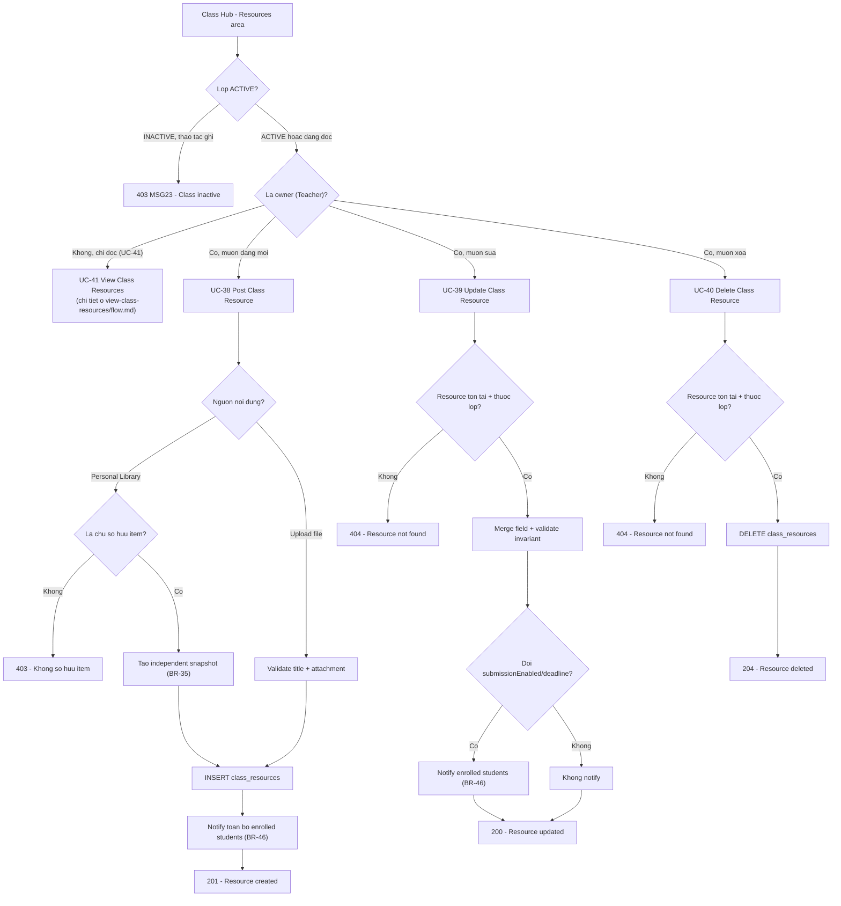

# Manage Class Resources — Flow (UC-38 → UC-41)

> Chức năng Teacher đăng/sửa/xóa resource-assignment trong lớp mình sở hữu (UC-38 Post, UC-39
> Update, UC-40 Delete), đặt cạnh chức năng đọc đã có (UC-41 View, xem
> [`../view-class-resources/flow.md`](../view-class-resources/flow.md)) để có bức tranh đầy đủ của
> khu vực "Resources" trong Class Hub.
> API spec: [`../API_designs/manage-class-resources.md`](../API_designs/manage-class-resources.md).
> Kế thừa CRUD lớp ở [`../class-management/class-flow.md`](../class-management/class-flow.md). Kiến
> trúc theo [`../layered-architecture.md`](../layered-architecture.md).

## 1. Nguyên tắc

- **Nguồn chính là SRS**: tài liệu này bao phủ đúng `UC-38/39/40` (phía Teacher ghi dữ liệu). `UC-41`
  (phía Student/Teacher đọc) đã có flow riêng, đầy đủ ở
  [`../view-class-resources/flow.md`](../view-class-resources/flow.md) — không lặp lại chi tiết ở
  đây, chỉ dẫn 1 node tham chiếu trong sơ đồ tổng quan bên dưới.
- **Owner + lớp `ACTIVE`, khác hẳn UC-41**: cả 3 thao tác ghi đều chặn nếu lớp `INACTIVE` (BR-37),
  trong khi UC-41 (đọc) vẫn hoạt động bình thường kể cả `INACTIVE` (BR-39).
- **2 nguồn nội dung loại trừ nhau khi Post**: Personal Library item (`LIBRARY_SNAPSHOT`) hoặc file
  upload trực tiếp (`FILE_UPLOAD`) — không kết hợp trong 1 lần post (UC-38 Alternative Flow).
- **Resource là snapshot độc lập (BR-35)**: sau khi Post, bản ghi `class_resources` không còn phụ
  thuộc `LibraryContent` gốc để hiển thị; Update không được đổi `sourceType`/`sourceLibraryContentId`;
  xóa/sửa resource trong lớp không ảnh hưởng ngược lại Personal Library.
- **Chỉ notify lại khi đổi submission setting hoặc deadline (UC-39)**: sửa `title`/`description`/
  `attachment` thường thì không kích hoạt notification, khác với Post (luôn notify toàn bộ enrolled
  students, BR-46).
- **Không có dữ liệu submission thật**: `Submission` (`UC-44→48`) chưa được thiết kế, nên "xóa mọi
  submission liên quan" (BR-45) trong UC-40 hiện chỉ là xóa `class_resources` — xem "Điểm mở".

## 2. Mapping SRS

| SRS | Tên | Mô tả trong flow |
|-----|-----|-------------------|
| UC-38 | Post Class Resource | Teacher đăng resource/assignment mới vào lớp mình sở hữu, từ Personal Library hoặc upload file |
| UC-39 | Update Class Resource | Teacher sửa resource đã đăng: mô tả, tệp đính kèm, cài đặt nộp bài, deadline |
| UC-40 | Delete Class Resource | Teacher xóa vĩnh viễn resource khỏi lớp |
| UC-41 | View Class Resources | Student/Teacher xem danh sách resource đã đăng — chi tiết ở [`../view-class-resources/flow.md`](../view-class-resources/flow.md) |
| BR-04 | Sign-in required | Teacher phải đăng nhập mới thao tác được |
| BR-34 | Class access/ownership | Chỉ owner mới đăng/sửa/xóa resource của lớp |
| BR-35 | Resource là snapshot độc lập | Post tạo bản sao độc lập khỏi Personal Library; Update/Delete không ảnh hưởng ngược nguồn gốc |
| BR-37 | Inactive read-only | Lớp `INACTIVE` chặn cả 3 thao tác ghi (Post/Update/Delete) |
| BR-39 | Inactive vẫn xem/tải được | Không áp dụng cho UC-38/39/40 (ghi) — chỉ áp dụng UC-41 (đọc) |
| BR-45 | Xóa resource giữ/xóa submission | UC-40 phải xóa mọi submission liên quan — hiện chưa có bảng `submissions`, ghi chú ở "Điểm mở" |
| BR-46 | Notification khi thay đổi resource | Post luôn notify; Update chỉ notify khi đổi submission setting hoặc deadline |

## 3. Luồng chính

### 3.1. Teacher đăng resource mới (`POST /api/classes/{id}/resources`)

```text
Teacher                          Backend                              Database
  |                                |                                     |
  | POST /api/classes/{id}/resources                                   |
  | { title?, description?, sourceType, sourceLibraryContentId?,       |
  |   attachment?, submissionEnabled, deadline? }                      |
  |------------------------------->                                    |
  |                                | load class theo id                  |
  |                                |------------------------------------->
  |                                | Classroom hoac khong tim thay        |
  |                                <-------------------------------------|
  |                                | khong ton tai -> 404, dung tai day  |
  |                                | verify owner (BR-34)                |
  |                                |   khong phai owner -> 403           |
  |                                | verify status = ACTIVE (BR-37)      |
  |                                |   INACTIVE -> 403 MSG23              |
  |                                | sourceType = LIBRARY_SNAPSHOT?       |
  |                                |------------------------------------->
  |                                | tra LibraryContent theo id           |
  |                                | khong ton tai -> 404                 |
  |                                | ownerId != currentUserId -> 403      |
  |                                <-------------------------------------|
  |                                | copy title/thumbnailUrl neu can      |
  |                                |   (tao "independent snapshot", BR-35)|
  |                                | sourceType = FILE_UPLOAD?             |
  |                                |   validate title + attachment bat    |
  |                                |   buoc co mat, khong tra LibraryContent|
  |                                | validate submissionEnabled/deadline  |
  |                                |   (thieu deadline khi enabled -> 400)|
  |                                | INSERT class_resources               |
  |                                |------------------------------------->
  |                                | resource moi (id, createdAt, ...)    |
  |                                <-------------------------------------|
  |                                | lay danh sach toan bo enrolled       |
  |                                |   student ids (khong phan trang)     |
  |                                |------------------------------------->
  |                                | tao Notification + recipients        |
  |                                | publish qua NotificationStreamPort   |
  |                                |------------------------------------->
  |<-------------------------------|                                     |
  | 201 ClassResourceSummaryDto (MSG08)                                  |
```

- Guard "load class → verify owner → verify ACTIVE" chạy **trước** mọi validate khác, giống thứ tự
  của `POST /members` (`add-student/flow.md`).
- Nhánh `LIBRARY_SNAPSHOT` và `FILE_UPLOAD` loại trừ nhau — chỉ 1 trong 2 nhánh validate chạy tùy
  `sourceType`.
- Notification gửi **sau khi** commit resource thành công — insert thất bại thì không gửi notify.

### 3.2. Teacher sửa resource đã đăng (`PATCH /api/classes/{id}/resources/{resourceId}`)

```text
Teacher                          Backend                              Database
  |                                |                                     |
  | PATCH .../resources/{resourceId}                                    |
  | { title?, description?, attachment?, submissionEnabled?, deadline? }|
  |------------------------------->                                    |
  |                                | load class + verify owner + ACTIVE  |
  |                                |   (giong 3.1)                       |
  |                                | load resource theo resourceId       |
  |                                |------------------------------------->
  |                                | khong ton tai / khac classId -> 404 |
  |                                <-------------------------------------|
  |                                | attachment gui nhung resource goc   |
  |                                |   la LIBRARY_SNAPSHOT -> 400        |
  |                                | merge field co mat vao ban ghi hien |
  |                                |   tai, validate lai invariant        |
  |                                |   submissionEnabled/deadline sau khi |
  |                                |   merge -> sai -> 400               |
  |                                | so sanh submissionEnabled/deadline   |
  |                                |   TRUOC vs SAU merge                 |
  |                                | UPDATE class_resources (updatedAt)   |
  |                                |------------------------------------->
  |                                | resource da cap nhat                 |
  |                                <-------------------------------------|
  |                                | thay doi? -> lay enrolled student    |
  |                                |   ids, notify (BR-46)                |
  |                                | khong thay doi -> bo qua notify      |
  |<-------------------------------|                                     |
  | 200 ClassResourceSummaryDto (MSG08)                                  |
```

- Bước "so sánh trước vs sau merge" là nhánh quyết định quan trọng nhất — chỉ trigger notify khi
  `submissionEnabled` hoặc `deadline` thực sự đổi giá trị, đúng SRS Alternative Flow "Step
  4_Update submission settings or deadline".
- `sourceType`/`sourceLibraryContentId` không nằm trong `UpdateClassResourceRequest` — không có
  đường nào để đổi 2 field này sau khi tạo (BR-35).

### 3.3. Teacher xóa resource (`DELETE /api/classes/{id}/resources/{resourceId}`)

```text
Teacher                          Backend                              Database
  |                                |                                     |
  | DELETE .../resources/{resourceId}                                   |
  |------------------------------->                                    |
  |                                | load class + verify owner + ACTIVE  |
  |                                |   (giong 3.1)                       |
  |                                | load resource theo resourceId       |
  |                                |------------------------------------->
  |                                | khong ton tai / khac classId -> 404 |
  |                                <-------------------------------------|
  |                                | DELETE class_resources WHERE id=... |
  |                                |------------------------------------->
  |<-------------------------------|                                     |
  | 204 No Content                                                       |
```

- Popup xác nhận (MSG09 "sẽ xóa cả submission liên quan") và thông báo kết quả (MSG10) là hành vi
  FE trước/sau khi gọi endpoint — endpoint xóa ngay khi được gọi, không có bước xác nhận ở tầng API.
- "Xóa mọi submission liên quan" (BR-45) hiện không có tác dụng thật vì chưa có bảng `submissions` —
  xem "Điểm mở".

## 4. Sơ đồ tổng quan (UC-38 → UC-41)



## 5. Model dữ liệu

Không có migration mới — dùng đúng bảng `class_resources` đã tạo ở
`V23__create_class_resources.sql` (xem chi tiết cột ở
[`../view-class-resources/flow.md`](../view-class-resources/flow.md#5-model-du-lieu-du-kien)). UC-38
là nguồn ghi chính vào bảng này; UC-39/40 sửa/xóa dòng đã có.

- Chưa có bảng `submissions` — khi UC-44→48 được thiết kế, cần thêm FK
  `submissions.class_resource_id REFERENCES class_resources(id) ON DELETE CASCADE` để `DELETE` ở
  UC-40 tự động xóa submission liên quan đúng BR-45, thay vì phải sửa lại service.

## 6. Layered mapping

```text
domain/model/classroom/           ClassResource, ResourceSourceType (da co, khong doi)
repository/repositories/          ClassResourceRepository (them save/findById/deleteById)
                                   ClassMemberRepository (them findAllStudentIds, khong phan trang)
                                   LibraryContentRepository (dung lai findActiveById)
infrastructure/persistence/       ClassResourceEntity (da co, khong doi schema)
service/classroom/                ClassResourceService (them postResource/updateResource/
                                   deleteResource + requireOwnedActiveClass/requireOwnedClass moi)
presentation/dto/classroom/       PostClassResourceRequest, UpdateClassResourceRequest (moi),
                                   ClassResourceSummaryDto (dung lai)
presentation/controller/          ClassController (them 3 method: POST/PATCH/DELETE resources)
```

- `ClassResourceService` giữ nguyên là service riêng cho resource (tách khỏi
  `ClassManagementService`/`ClassEnrollmentService`) nhưng tự có cặp guard
  `requireOwnedActiveClass`/`requireOwnedClass` riêng — lặp đúng pattern đã thấy ở 2 service kia,
  không refactor dùng chung 1 helper.
- Controller mỏng: nhận request, gọi `ClassResourceService`, trả response — không xử lý business rule
  trong controller.

## 7. Lỗi và rule cần xử lý

| Tình huống | Kết quả |
|------------|---------|
| Lớp không tồn tại | `404` |
| User không phải owner gọi Post/Update/Delete | `403` |
| Lớp đang `INACTIVE` khi gọi Post/Update/Delete | `403` (MSG23) |
| Post `LIBRARY_SNAPSHOT` với `sourceLibraryContentId` không tồn tại | `404` |
| Post `LIBRARY_SNAPSHOT` với item không thuộc sở hữu teacher | `403` |
| Post `FILE_UPLOAD` thiếu `title` hoặc `attachment` | `400` |
| Post với `submissionEnabled=true` nhưng thiếu `deadline` | `400` |
| Update gửi `attachment` cho resource gốc là `LIBRARY_SNAPSHOT` | `400` |
| Update/Delete với `resourceId` không tồn tại hoặc không thuộc lớp | `404` |
| Update đổi `submissionEnabled`/`deadline` | Notify lại toàn bộ enrolled students |
| Update chỉ đổi `title`/`description`/`attachment` | Không notify |
| Lỗi hệ thống giữa lúc ghi (Post/Update/Delete) | `500`/`502` (MSG25) |

## 8. Acceptance checklist

- Teacher post resource từ Personal Library item của chính mình → `201`, resource xuất hiện trong
  `GET /{id}/resources`, toàn bộ học sinh enrolled nhận notification.
- Teacher post resource từ item **không** thuộc sở hữu mình → `403`, không tạo resource nào.
- Teacher post resource kiểu `FILE_UPLOAD` thiếu `attachment` → `400`, không tạo resource nào.
- Teacher post khi lớp `INACTIVE` → `403` MSG23, không tạo resource nào.
- Teacher update resource chỉ đổi `description` → `200`, **không** có notification mới nào được gửi.
- Teacher update resource đổi `deadline` → `200`, toàn bộ enrolled students nhận notification mới.
- Teacher update gửi `attachment` cho resource `LIBRARY_SNAPSHOT` → `400`, resource không đổi.
- Teacher delete resource đang tồn tại → `204`, resource biến mất khỏi `GET /{id}/resources`.
- Teacher delete/update resource với `resourceId` không thuộc lớp đang thao tác → `404`.
- User không phải owner (kể cả enrolled student) gọi Post/Update/Delete → `403`.

## 9. Điểm mở

- `UC-42 View Class Resource Detail`, `UC-43 Download Assigned Material` — kế thừa cùng
  `ClassResourceRepository`, thiết kế sau khi tài liệu này chốt.
- `UC-47/48` (Submit/Unsubmit Assignment, phía Student) đã thiết kế và build ở
  [`../submit-assignment/flow.md`](../submit-assignment/flow.md) — `DELETE` (UC-40) đã có FK cascade
  thật từ `submissions.class_resource_id` (đáp ứng BR-45), và `submissionStatus` trong
  `ClassResourceSummaryDto` đã phản ánh dữ liệu thật thay vì placeholder.
- `UC-44/45/46` (View Submissions List/Detail, Download Submission File, phía Teacher) — đã thiết kế ở
  [`../review-submissions/flow.md`](../review-submissions/flow.md).
- UI Teacher-side (Post/Update/Delete resource) ở FE (`fe/components/classroom/`) chưa tồn tại, sẽ
  thiết kế sau khi API được chốt.
