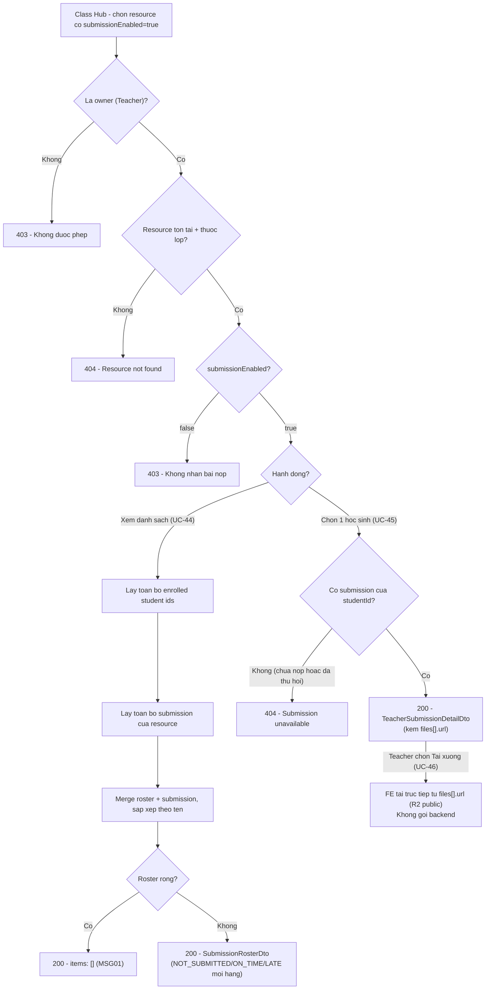

# Review Submissions — Flow (UC-44 → UC-46)

> Chức năng Teacher xem danh sách bài nộp, xem chi tiết 1 bài nộp, và tải file bài nộp của học sinh cho
> 1 class resource có bật `submissionEnabled` (UC-44 View Submissions List, UC-45 View Submission
> Detail, UC-46 Download Submission File) — nhánh Teacher-đọc của nhóm Submission (`UC-44→48`), đặt
> cạnh nhánh Student-ghi đã có ở [`../submit-assignment/flow.md`](../submit-assignment/flow.md).
> API spec: [`../API_designs/review-submissions.md`](../API_designs/review-submissions.md). Kiến trúc
> theo [`../layered-architecture.md`](../layered-architecture.md).

## 1. Nguyên tắc

- **Nguồn chính là SRS**: bám `UC-44 View Submissions List` / `UC-45 View Submission Detail` / `UC-46
  Download Submission File`, không mở rộng thêm ngoài SRS (khác `submit-assignment.md`, vốn mở rộng
  nộp bài bằng text).
- **Owner-only, không phải enrolled student**: giống mọi endpoint Teacher khác của nhóm Class
  (`manage-class-resources.md`), actor đọc ở đây là chủ lớp — khác `submit-assignment.md` (actor là
  enrolled student, không phải owner).
- **Đọc được bất kể trạng thái lớp (BR-39)**: cả 2 endpoint không chặn theo `status` — SRS UC-46 Alt
  Flow "Step 6_Class is inactive" xác nhận rõ download vẫn được phép khi lớp `INACTIVE`, nhất quán với
  `GET /{id}/resources` (`../view-class-resources/flow.md`).
- **Roster đầy đủ, không chỉ người đã nộp**: `UC-44` luôn trả toàn bộ học sinh enrolled, merge với dữ
  liệu `submissions` đã có — khác việc chỉ liệt kê các dòng có trong bảng `submissions`.
- **Không phân trang**: SRS mô tả "retrieves the currently enrolled students" như một bước duy nhất,
  không có tham số trang — khác `GET /members` (`../add-student/flow.md`).
- **UC-46 không chạm backend**: tải file là hành động FE thuần túy trên `url` public R2 đã có sẵn từ
  response UC-45 — không có bước gọi API nào cho riêng UC-46 (xem mục 3.3 và "Quyết định riêng" ở API
  spec).
- **Không có dữ liệu/bảng mới**: tái dùng đúng `Submission`/`SubmissionFile`/`SubmissionRepository` đã
  định nghĩa ở `submit-assignment/flow.md` (bảng `submissions`/`submission_files`,
  `V25__create_submissions.sql`).

## 2. Mapping SRS

| SRS | Tên | Mô tả trong flow |
|-----|-----|-------------------|
| UC-44 | View Submissions List | Teacher xem toàn bộ học sinh enrolled + trạng thái nộp bài cho 1 resource có `submissionEnabled = true` |
| UC-45 | View Submission Detail | Teacher xem chi tiết bài nộp của 1 học sinh cụ thể |
| UC-46 | Download Submission File | Teacher tải file đã nộp — dùng thẳng `url` public từ response UC-45, không có endpoint riêng |
| BR-04 | Sign-in required | Teacher phải đăng nhập mới xem được |
| BR-34 | Class access/ownership | Chỉ owner (Teacher) mới xem được danh sách/chi tiết bài nộp của lớp mình |
| BR-39 | Inactive vẫn xem/tải được | Cả `UC-44`/`UC-45`/`UC-46` đều hoạt động bình thường khi lớp `INACTIVE` |

## 3. Luồng chính

### 3.1. Teacher xem danh sách bài nộp (`GET /api/classes/{classId}/resources/{resourceId}/submissions`)

```text
Teacher                           Backend                              Database
  |                                |                                     |
  | GET .../resources/{resourceId}/submissions                          |
  |------------------------------->                                    |
  |                                | load class theo classId             |
  |                                |------------------------------------->
  |                                | Classroom hoac khong tim thay        |
  |                                <-------------------------------------|
  |                                | khong ton tai -> 404, dung tai day  |
  |                                | verify la owner (BR-34)              |
  |                                |   khong phai owner -> 403             |
  |                                | load resource theo resourceId        |
  |                                |------------------------------------->
  |                                | khong ton tai / khac classId -> 404 |
  |                                <-------------------------------------|
  |                                | verify submissionEnabled = true      |
  |                                |   false -> 403                       |
  |                                | lay toan bo enrolled student ids     |
  |                                |   (khong phan trang)                 |
  |                                |------------------------------------->
  |                                | lay ten/email theo id (batch)        |
  |                                |------------------------------------->
  |                                | lay toan bo submission cua resource  |
  |                                |------------------------------------->
  |                                | danh sach submission (co the rong)   |
  |                                <-------------------------------------|
  |                                | merge: hoc sinh khong co submission  |
  |                                |   -> NOT_SUBMITTED, submittedAt=null |
  |                                | sap xep theo studentName             |
  |<-------------------------------|                                     |
  | 200 SubmissionRosterDto                                              |
```

- Guard "load class → verify owner → load resource → verify submissionEnabled" chạy **trước** mọi
  truy vấn roster/submission — cùng thứ tự ưu tiên đã dùng ở các flow Class khác.
- Bước merge roster + submissions là bước riêng của luồng này (không tồn tại ở `UC-41`/`UC-47`): mọi
  học sinh enrolled đều xuất hiện trong kết quả, bất kể đã nộp bài hay chưa.
- Không có postcondition ghi — thuần đọc.

### 3.2. Teacher xem chi tiết 1 bài nộp (`GET /api/classes/{classId}/resources/{resourceId}/submissions/{studentId}`)

```text
Teacher                           Backend                              Database
  |                                |                                     |
  | GET .../submissions/{studentId}                                     |
  |------------------------------->                                    |
  |                                | load class + verify owner            |
  |                                |   (giong 3.1)                        |
  |                                | load resource theo resourceId        |
  |                                |------------------------------------->
  |                                | khong ton tai / khac classId -> 404 |
  |                                <-------------------------------------|
  |                                | tim submission cua                   |
  |                                |   (resourceId, studentId)            |
  |                                |------------------------------------->
  |                                | khong co -> 404                      |
  |                                <-------------------------------------|
  |                                | lay ten hoc sinh theo studentId      |
  |                                |------------------------------------->
  |<-------------------------------|                                     |
  | 200 TeacherSubmissionDetailDto                                       |
```

- `404` khi học sinh chưa từng nộp **hoặc** đã thu hồi (unsubmit) — cùng 1 nhánh lỗi, không phân biệt
  2 trường hợp ở tầng API (đúng SRS "Step 2_Submission is unavailable").
- Không có postcondition ghi, hoạt động cả khi lớp `INACTIVE`.

### 3.3. Teacher tải file bài nộp (UC-46, không gọi endpoint riêng)

```text
Teacher                           FE (browser)                         R2 (public)
  |                                |                                     |
  | (dang xem TeacherSubmissionDetailDto tu 3.2, da co files[].url)      |
  | chon "Tai xuong" 1 file                                              |
  |------------------------------->                                    |
  |                                | kich hoat download tren files[].url  |
  |                                |   (the <a download> hoac fetch blob) |
  |                                |------------------------------------->
  |                                | file tra ve truc tiep tu R2          |
  |                                <-------------------------------------|
  |<-------------------------------|                                     |
  | File duoc luu ve thiet bi                                            |
```

- Không có request nào tới backend `be` cho riêng bước này — toàn bộ điều kiện chặn (owner, submission
  tồn tại, đã thu hồi hay chưa) đã được xử lý ở bước 3.2 lúc load `TeacherSubmissionDetailDto`. Nếu
  bước 3.2 trả `404`, FE không có `url` để tải, tự nhiên chặn được SRS Alt Flow "Step 3_Submission has
  been withdrawn" / "Step 3_Submitted file does not exist" mà không cần logic backend thêm.
- "Step 6_Class is inactive" trong SRS không cần xử lý riêng vì bước 3.2 không chặn theo `ACTIVE`
  (BR-39) — download luôn khả dụng nếu `files[].url` có mặt.

## 4. Sơ đồ tổng quan (UC-44 → UC-46)



## 5. Model dữ liệu

Không có migration mới — tái dùng đúng bảng `submissions`/`submission_files` từ
`V25__create_submissions.sql` (xem chi tiết cột ở
[`../submit-assignment/flow.md`](../submit-assignment/flow.md#5-model-dữ-liệu)).

- `findAllByResource(classResourceId)` cần shape tương đương:

  ```sql
  SELECT s.*, sf.*
  FROM submissions s
  LEFT JOIN submission_files sf ON sf.submission_id = s.id
  WHERE s.class_resource_id = :classResourceId;
  ```

  Gom nhóm theo `s.id` ở tầng adapter (giống cách `findByResourceAndStudent` đã gom `submission_files`
  cho 1 submission) để trả `List<SubmissionWithFiles>`.
- Roster (toàn bộ học sinh enrolled) không đến từ bảng `submissions` — lấy từ
  `class_members`/`app_users` qua `ClassMemberRepository.findAllStudentIds` +
  `AppUserRepository.findAllById`, những method đã tồn tại.

## 6. Layered mapping

```text
domain/model/classroom/           Submission, SubmissionFile, SubmissionStatus (da co, khong doi)
repository/repositories/          SubmissionRepository (them findAllByResource(UUID): List<SubmissionWithFiles>)
                                   ClassMemberRepository (dung lai findAllStudentIds)
                                   AppUserRepository (dung lai findAllById/findById)
infrastructure/persistence/       JpaSubmissionRepository (them query cho findAllByResource)
service/classroom/                SubmissionService (them requireOwnedClass moi +
                                   listSubmissions/getSubmissionDetail)
presentation/dto/classroom/       SubmissionRosterDto, SubmissionRosterEntryDto,
                                   TeacherSubmissionDetailDto (moi)
presentation/controller/          ClassController (them 2 method GET submissions/submissions/{studentId})
```

- `SubmissionService` vẫn là service duy nhất sở hữu domain `Submission` (không tách service Teacher
  riêng) — thêm guard `requireOwnedClass` cạnh 2 guard Student đã có
  (`requireEnrolledActiveClass`/`requireEnrolledClass`), mỗi guard độc lập theo đúng pattern đã dùng ở
  `ClassResourceService`.
- Controller mỏng: nhận request, gọi `SubmissionService`, trả response — không xử lý merge
  roster/submission trong controller.

## 7. Lỗi và rule cần xử lý

| Tình huống | Kết quả |
|------------|---------|
| Lớp không tồn tại | `404` |
| User không phải owner gọi List/Detail | `403` |
| `resourceId` không tồn tại hoặc không thuộc lớp | `404` |
| List khi `resource.submissionEnabled = false` | `403` |
| List khi lớp không có học sinh enrolled | `200`, `items: []` (MSG01) |
| List khi chưa học sinh nào nộp bài | `200`, mọi hàng `NOT_SUBMITTED` |
| Detail của học sinh chưa nộp hoặc đã thu hồi | `404` |
| Detail của học sinh đã nộp | `200`, đầy đủ `textContent`/`files`/`status`/`submittedAt` |
| List/Detail khi lớp `INACTIVE` | Vẫn `200` bình thường (BR-39), không bị chặn |
| Tải file (UC-46) khi `files[].url` có sẵn | FE tải trực tiếp, không qua backend |
| Lỗi hệ thống giữa lúc đọc (List/Detail) | `500`/`502` (MSG25) |

## 8. Acceptance checklist

- Owner gọi `GET .../submissions` cho resource có học sinh đã nộp On Time và Late → `200`, đúng
  `status` từng học sinh, sắp xếp theo tên.
- Owner gọi `GET .../submissions` cho resource chưa ai nộp nhưng có học sinh enrolled → `200`, toàn bộ
  `NOT_SUBMITTED`.
- Owner gọi `GET .../submissions` cho lớp không có học sinh enrolled → `200`, `items: []`.
- Owner gọi `GET .../submissions` cho resource `submissionEnabled = false` → `403`.
- Non-owner (kể cả enrolled student, kể cả teacher khác) gọi List/Detail → `403`.
- Owner gọi `GET .../submissions/{studentId}` cho học sinh đã nộp → `200`, `files[]` đúng danh sách
  file đã nộp.
- Owner gọi `GET .../submissions/{studentId}` cho học sinh chưa nộp → `404`.
- Owner gọi `GET .../submissions/{studentId}` cho học sinh đã nộp rồi Unsubmit → `404`.
- Owner gọi List/Detail khi lớp `INACTIVE` → vẫn `200`, không bị chặn.
- `resourceId` thuộc lớp khác (không phải `classId` trên URL) → `404` cho cả List/Detail.

## 9. Điểm mở

- UI Teacher-side (danh sách bài nộp, màn chi tiết, nút tải file) ở FE
  (`fe/components/classroom/`) chưa tồn tại, sẽ thiết kế sau khi API được chốt.
- Giới hạn tổng số file/tổng dung lượng cho 1 lần nộp chưa được định nghĩa — kế thừa nguyên trạng từ
  `submit-assignment/flow.md`, không thuộc phạm vi tài liệu này.
