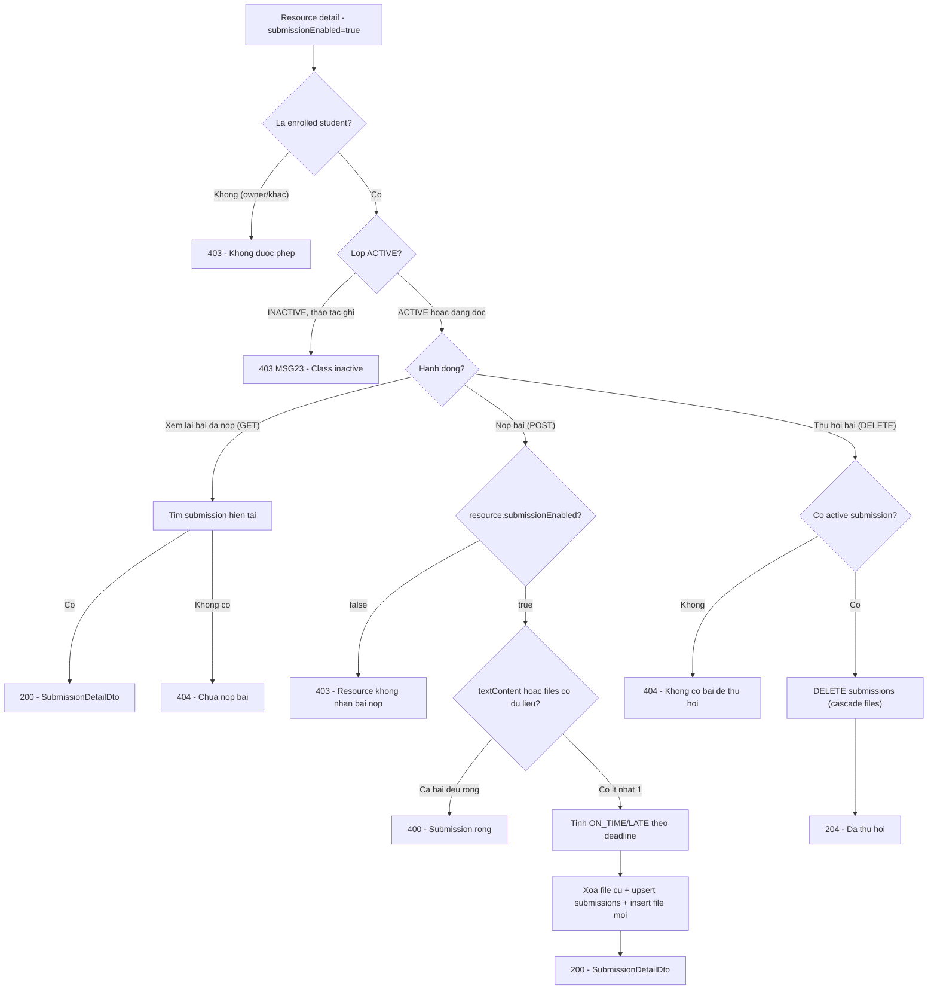

# Submit Assignment — Flow (UC-47 → UC-48)

> Chức năng Student nộp bài / thu hồi bài nộp cho 1 class resource có bật `submissionEnabled` (UC-47
> Submit, UC-48 Unsubmit) — nhánh Student-ghi của nhóm Submission (`UC-44→48`), đặt cạnh nhánh
> Teacher-ghi đã có ở [`../manage-class-resources/flow.md`](../manage-class-resources/flow.md) và
> nhánh đọc dùng chung ở [`../view-class-resources/flow.md`](../view-class-resources/flow.md).
> API spec: [`../API_designs/submit-assignment.md`](../API_designs/submit-assignment.md). Kiến trúc
> theo [`../layered-architecture.md`](../layered-architecture.md).
> **Khác SRS**: SRS gốc (2.7.19 UC-47) chỉ mô tả nộp bằng file; ở đây cho phép nộp bằng **text (rich
> text)**, **file**, hoặc **cả hai cùng lúc** — xem mục 1 và "Quyết định riêng" ở API spec.

## 1. Nguyên tắc

- **Nguồn chính là SRS, có 1 điểm mở rộng có chủ đích**: bám `UC-47 Submit Assignment` / `UC-48
  Unsubmit Assignment`, chỉ khác ở loại nội dung được phép nộp (text và/hoặc file thay vì chỉ file).
- **Enrolled student, không phải owner**: khác mọi endpoint ghi khác của nhóm Class (`add-student.md`,
  `manage-class-resources.md` đều là Teacher owner), ở đây actor ghi là Student. Cần guard mới
  `requireEnrolledActiveClass` — riêng biệt, không dùng lại `requireOwnedActiveClass`.
- **Lớp `ACTIVE` mới được nộp/thu hồi (BR-37)**: giống các thao tác ghi khác, `INACTIVE` chặn cả
  `POST` lẫn `DELETE` submission — khác `GET` (đọc được cả khi `INACTIVE`, BR-39, giống `UC-41`).
- **Một active submission per (resource, student) — BR-36**: submit lại luôn **thay thế toàn bộ**
  submission trước đó (text + toàn bộ file), không cộng dồn, không giữ lịch sử phiên bản.
- **On Time / Late chốt tại thời điểm submit**: so `submittedAt` với `resource.deadline` ngay lúc ghi,
  lưu cố định — sửa `deadline` sau đó (`UC-39 Update Class Resource`) không làm đổi lại tag đã lưu.
- **Không có dữ liệu Submission thật trước tài liệu này**: `manage-class-resources/flow.md` và
  `view-class-resources/flow.md` đều để ngỏ nhóm `UC-44→48` vì domain `Submission` chưa tồn tại — tài
  liệu này là nơi đầu tiên định nghĩa bảng `submissions`/`submission_files`.

## 2. Mapping SRS

| SRS | Tên | Mô tả trong flow |
|-----|-----|-------------------|
| UC-47 | Submit Assignment | Student nộp bài cho 1 resource có `submissionEnabled = true`; SRS gốc chỉ file, ở đây mở rộng thêm text |
| UC-48 | Unsubmit Assignment | Student thu hồi active submission để nộp lại |
| BR-04 | Sign-in required | Student phải đăng nhập mới thao tác được |
| BR-34 | Class access/ownership | Chỉ enrolled student (không phải owner) mới nộp/thu hồi bài của lớp |
| BR-36 | Một active submission | Nộp lại thay thế toàn bộ submission cũ, không version history |
| BR-37 | Inactive read-only | Lớp `INACTIVE` chặn cả nộp lẫn thu hồi |
| BR-39 | Inactive vẫn xem/tải được | Áp dụng cho endpoint đọc (`GET .../submission`) — không áp dụng `POST`/`DELETE` |
| BR-45 | Xóa resource xóa cả submission | `submissions.class_resource_id` có `ON DELETE CASCADE` — `DELETE` ở `UC-40` tự động dọn sạch |
| — | Mở rộng ngoài SRS | Submission có thể chứa `textContent` (rich text HTML) độc lập hoặc kết hợp với `files` |

## 3. Luồng chính

### 3.1. Student nộp bài (`POST /api/classes/{classId}/resources/{resourceId}/submission`)

```text
Student                           Backend                              Database
  |                                |                                     |
  | POST .../resources/{resourceId}/submission                          |
  | { textContent?, files? }                                            |
  |------------------------------->                                    |
  |                                | load class theo classId             |
  |                                |------------------------------------->
  |                                | Classroom hoac khong tim thay        |
  |                                <-------------------------------------|
  |                                | khong ton tai -> 404, dung tai day  |
  |                                | verify la enrolled student           |
  |                                |   (khong phai owner) -> 403 neu sai |
  |                                | verify status = ACTIVE (BR-37)       |
  |                                |   INACTIVE -> 403 MSG23              |
  |                                | load resource theo resourceId        |
  |                                |------------------------------------->
  |                                | khong ton tai / khac classId -> 404 |
  |                                <-------------------------------------|
  |                                | verify submissionEnabled = true      |
  |                                |   false -> 403                       |
  |                                | sanitize textContent (BlogContentSanitizer)|
  |                                | validate: textContent rong (sau      |
  |                                |   sanitize) VA files rong -> 400     |
  |                                | tinh status = now() vs deadline      |
  |                                |   (ON_TIME | LATE)                   |
  |                                | xoa submission_files cu (neu co)     |
  |                                | upsert submissions (unique          |
  |                                |   class_resource_id+student_id)      |
  |                                | insert submission_files moi          |
  |                                |------------------------------------->
  |                                | submission da luu                    |
  |                                <-------------------------------------|
  |<-------------------------------|                                     |
  | 200 SubmissionDetailDto                                              |
```

- Guard "load class → verify enrolled → verify ACTIVE → load resource → verify submissionEnabled"
  chạy **trước** validate nội dung — cùng thứ tự ưu tiên đã dùng ở `manage-class-resources/flow.md`.
- Bước xóa `submission_files` cũ + insert mới + upsert `submissions` nằm trong **1 transaction** —
  không có trạng thái nửa vời (còn file cũ nhưng submission đã là bản mới).
- Không có bước validate file type/size ở đây — đã xảy ra khi FE gọi `POST /api/uploads` trước đó
  (giống cách `manage-class-resources.md` xử lý `attachment`).

### 3.2. Student thu hồi bài nộp (`DELETE /api/classes/{classId}/resources/{resourceId}/submission`)

```text
Student                           Backend                              Database
  |                                |                                     |
  | DELETE .../resources/{resourceId}/submission                       |
  |------------------------------->                                    |
  |                                | load class + verify enrolled +      |
  |                                |   verify ACTIVE (giong 3.1)          |
  |                                | load resource theo resourceId        |
  |                                |------------------------------------->
  |                                | khong ton tai / khac classId -> 404 |
  |                                <-------------------------------------|
  |                                | tim active submission cua           |
  |                                |   (resourceId, currentStudentId)     |
  |                                |------------------------------------->
  |                                | khong co -> 404                      |
  |                                <-------------------------------------|
  |                                | DELETE submissions WHERE id=...      |
  |                                |   (cascade submission_files)         |
  |                                |------------------------------------->
  |<-------------------------------|                                     |
  | 204 No Content                                                       |
```

- Popup xác nhận (SRS Normal Flow step 3) là hành vi FE trước khi gọi `DELETE` — endpoint xóa ngay khi
  được gọi, không có bước xác nhận ở tầng API.
- Xóa là **vĩnh viễn** (không soft-delete) — khớp BR-36 "không giữ version history".

### 3.3. Student xem lại bài đã nộp (`GET /api/classes/{classId}/resources/{resourceId}/submission`, ngoài SRS)

```text
Student                           Backend                              Database
  |                                |                                     |
  | GET .../resources/{resourceId}/submission                           |
  |------------------------------->                                    |
  |                                | load class + verify enrolled         |
  |                                |   (khong check ACTIVE - BR-39)       |
  |                                | load resource theo resourceId        |
  |                                |------------------------------------->
  |                                | khong ton tai / khac classId -> 404 |
  |                                <-------------------------------------|
  |                                | tim submission cua                   |
  |                                |   (resourceId, currentStudentId)     |
  |                                |------------------------------------->
  |                                | khong co -> 404                      |
  |                                <-------------------------------------|
  |<-------------------------------|                                     |
  | 200 SubmissionDetailDto                                              |
```

- Không có postcondition ghi — thuần đọc, hoạt động cả khi lớp `INACTIVE` (BR-39), giống
  `GET /{id}/resources`.

## 4. Sơ đồ tổng quan (UC-47 → UC-48)



## 5. Model dữ liệu

```sql
-- V25__create_submissions.sql
-- Bang nay phuc vu UC-47 (Submit)/UC-48 (Unsubmit). Ho tro ca text (rich text HTML, sanitize
-- bang BlogContentSanitizer) lan file (1-nhieu, bang con submission_files) - mo rong ngoai SRS
-- goc (chi mo ta file). Xem thiet ke: designs/API_designs/submit-assignment.md.

CREATE TABLE submissions (
    id                  UUID         PRIMARY KEY,
    class_resource_id   UUID         NOT NULL REFERENCES class_resources (id) ON DELETE CASCADE,
    student_id          UUID         NOT NULL REFERENCES app_users (id),
    text_content        TEXT,
    status              VARCHAR(20)  NOT NULL,
    submitted_at        TIMESTAMPTZ  NOT NULL,
    created_at          TIMESTAMPTZ  NOT NULL DEFAULT now(),
    updated_at          TIMESTAMPTZ  NOT NULL DEFAULT now(),
    CONSTRAINT uq_submissions_resource_student UNIQUE (class_resource_id, student_id)
);

CREATE INDEX idx_submissions_resource_id ON submissions (class_resource_id);

CREATE TABLE submission_files (
    id              UUID          PRIMARY KEY,
    submission_id   UUID          NOT NULL REFERENCES submissions (id) ON DELETE CASCADE,
    url             TEXT          NOT NULL,
    file_name       VARCHAR(255)  NOT NULL,
    content_type    VARCHAR(100)  NOT NULL,
    size_bytes      BIGINT        NOT NULL
);

CREATE INDEX idx_submission_files_submission_id ON submission_files (submission_id);
```

- `text_content`: `NULL` khi submission chỉ có file. Lưu HTML **đã sanitize** (không lưu HTML thô từ
  client) — cùng nguyên tắc `BlogPostService`/`HubCommentService` đang áp dụng.
- `status`: `ON_TIME | LATE`, tính 1 lần khi ghi, không có cột tính lại tự động — đọc `deadline` từ
  `class_resources` tại đúng thời điểm transaction chạy.
- `UNIQUE (class_resource_id, student_id)`: đúng 1 dòng submission cho mỗi cặp — upsert khi submit
  lại, xóa hẳn khi unsubmit (BR-36).
- `class_resource_id ... ON DELETE CASCADE`: xóa `class_resources` (UC-40 Delete Class Resource) tự
  động xóa toàn bộ submission liên quan — đáp ứng BR-45 mà `manage-class-resources.md` để ngỏ.
- `submission_files`: 1 submission có 0..n file; xóa/insert lại toàn bộ mỗi lần submit thay vì merge
  từng phần tử, khớp nguyên tắc "thay thế toàn bộ" (BR-36).

## 6. Layered mapping

```text
domain/model/classroom/           Submission, SubmissionFile (moi)
                                   SubmissionStatus (mo rong: them ON_TIME, LATE)
repository/repositories/           SubmissionRepository (moi): findByResourceAndStudent,
                                   upsert(Submission, List<SubmissionFile>), deleteByResourceAndStudent
                                   ClassResourceRepository (dung lai findById de load resource)
infrastructure/persistence/       SubmissionEntity, SubmissionFileEntity (moi) + Spring Data JPA repo
service/blog/                     BlogContentSanitizer (dung lai, khong sua doi)
service/classroom/                SubmissionService (moi): submit/unsubmit/getOwnSubmission +
                                   guard rieng requireEnrolledActiveClass
                                   ClassResourceService (sua listResources/toSummary de tra
                                   submissionStatus that qua SubmissionRepository)
presentation/dto/classroom/       SubmitAssignmentRequest, SubmissionFileRequest,
                                   SubmissionDetailDto (moi)
presentation/controller/          ClassController (them 3 method: POST/DELETE/GET submission)
```

- `SubmissionService` là service riêng, không gộp vào `ClassResourceService` — theo đúng nguyên tắc
  mỗi concern (Class/Enrollment/Resource) đã có service riêng với guard riêng, không tách helper dùng
  chung.
- Controller mỏng: nhận request, gọi `SubmissionService`, trả response — logic sanitize/tính
  ON_TIME-LATE/upsert nằm trong service.

## 7. Lỗi và rule cần xử lý

| Tình huống | Kết quả |
|------------|---------|
| Lớp không tồn tại | `404` |
| User không phải enrolled student (kể cả owner) gọi POST/DELETE/GET | `403` |
| Lớp đang `INACTIVE` khi gọi POST/DELETE | `403` (MSG23) |
| `resourceId` không tồn tại hoặc không thuộc lớp | `404` |
| Submit khi `resource.submissionEnabled = false` | `403` |
| Submit với `textContent` (sau sanitize) rỗng và `files` rỗng/thiếu | `400` |
| Submit chỉ `textContent`, chỉ `files`, hoặc cả hai có nội dung | `200`, lưu thành công |
| Submit sau `deadline` | `200`, `status = LATE` |
| Submit trước/đúng `deadline` | `200`, `status = ON_TIME` |
| Submit lại khi đã có active submission | `200`, thay thế toàn bộ text + file cũ |
| Unsubmit khi không có active submission | `404` |
| Unsubmit thành công | `204`, dòng `submissions` bị xóa vĩnh viễn |
| Xóa `class_resources` (UC-40) khi đã có submission | Cascade xóa toàn bộ submission liên quan (BR-45) |
| Lỗi hệ thống giữa lúc ghi (Submit/Unsubmit) | `500`/`502` (MSG25) |

## 8. Acceptance checklist

- Enrolled student submit chỉ `textContent` (không `files`) cho resource `submissionEnabled=true` →
  `200`, `GET .../submission` trả đúng `textContent`, `files: []`.
- Enrolled student submit chỉ `files` (không `textContent`) → `200`, `textContent: null`.
- Enrolled student submit cả `textContent` và `files` → `200`, cả hai đều được lưu.
- Enrolled student submit với cả hai field rỗng → `400`, không tạo/sửa dòng `submissions` nào.
- Owner (teacher) gọi `POST`/`DELETE`/`GET` submission của lớp mình → `403`.
- Student không enrolled trong lớp gọi bất kỳ endpoint nào → `403`.
- Submit khi lớp `INACTIVE` → `403` MSG23, submission không đổi.
- Submit trước `deadline` → `status = ON_TIME`; submit sau `deadline` → `status = LATE`.
- Submit lại sau khi đã có submission → thay thế đúng nội dung mới, không có 2 dòng `submissions` cho
  cùng `(class_resource_id, student_id)`.
- Unsubmit khi có active submission → `204`, `GET .../submission` sau đó trả `404`.
- Unsubmit khi không có active submission → `404`, không đổi dữ liệu.
- Submit lại ngay sau khi unsubmit → tạo submission mới bình thường (không bị chặn bởi dữ liệu cũ).
- Xóa `class_resources` đang có submission (qua `UC-40 Delete Class Resource`) → toàn bộ
  `submissions`/`submission_files` liên quan bị xóa theo cascade.

## 9. Điểm mở

- `UC-44 View Submissions List`, `UC-45 View Submission Detail`, `UC-46 Download Submission File` —
  phía Teacher đọc danh sách/chi tiết bài nộp học sinh trong lớp mình sở hữu, dùng chung
  `SubmissionRepository`/`SubmissionFile` vừa định nghĩa ở đây, thiết kế sau khi tài liệu này chốt.
- Cập nhật `ClassResourceService.listResources`/`toSummary` để `submissionStatus` trong
  `ClassResourceSummaryDto` phản ánh đúng trạng thái nộp bài thật của học sinh đang xem — nằm ngoài
  phạm vi migration/service mới ở đây nhưng là bước nối tiếp bắt buộc (xem "Phụ thuộc & thứ tự build"
  ở API spec).
- UI Student-side (form nộp bài text/file, nút thu hồi, xem lại bài đã nộp) ở FE
  (`fe/components/classroom/`) chưa tồn tại, sẽ thiết kế sau khi API được chốt.
- Giới hạn tổng số file/tổng dung lượng cho 1 lần nộp chưa được định nghĩa — hiện chỉ áp rule từng
  file riêng lẻ của `POST /api/uploads`.
