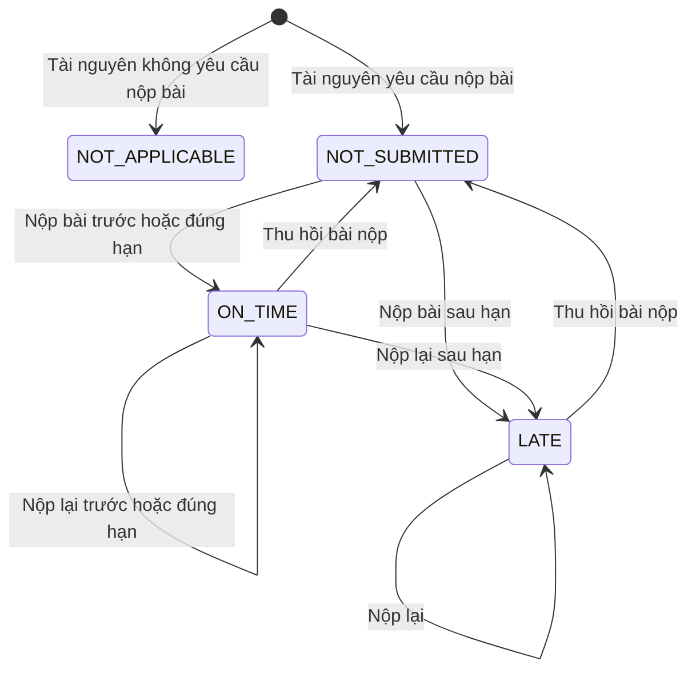

# State machine — Trạng thái bài nộp

- `NOT_APPLICABLE`: tài nguyên không bật `submissionEnabled`.
- `NOT_SUBMITTED`: chưa có bài nộp đang hoạt động.
- `ON_TIME`: bài được nộp trước hoặc đúng hạn.
- `LATE`: bài được nộp sau hạn.

Nộp lại thay thế bài nộp hiện tại; thu hồi xóa bài nộp và trở về `NOT_SUBMITTED`.
