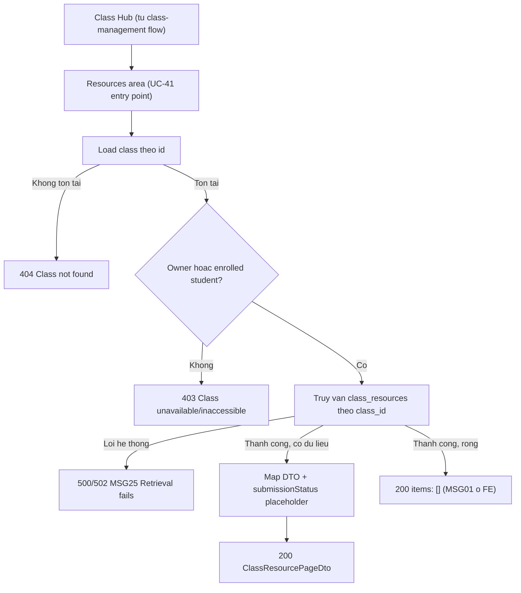

# View Class Resources — Flow

> Chức năng Student xem danh sách resource/assignment đã được đăng trong 1 lớp mình đang enrolled
> (UC-41). API spec: [`../API_designs/view-class-resources.md`](../API_designs/view-class-resources.md).
> Kế thừa CRUD lớp ở [`../class-management/class-flow.md`](../class-management/class-flow.md). Kiến
> trúc theo [`../layered-architecture.md`](../layered-architecture.md).

## 1. Nguyên tắc

- **Nguồn chính là SRS**: chức năng này bao phủ đúng `UC-41 View Class Resources`, không làm
  `UC-38/39/40` (Teacher ghi resource), `UC-42` (view detail), `UC-43` (download) hay `UC-44→48`
  (submission) — xem "Điểm mở".
- **Owner hoặc enrolled student, không phân biệt trạng thái lớp**: khác với Add Student/Class
  Management (chặn ghi khi `INACTIVE`), đọc resource **luôn được phép** kể cả lớp `INACTIVE`, theo
  `BR-39`.
- **Resource là snapshot độc lập (BR-35)**: dù đăng từ Personal Library hay upload file trực tiếp,
  dữ liệu đọc ở đây không cần join ngược về nguồn (Personal Library item) — mọi field hiển thị đã có
  sẵn trên chính bản ghi `class_resources`.
- **Không có dữ liệu nộp bài thật**: `Submission` chưa được thiết kế (`UC-44→48`), nên
  `submissionStatus` trong response chỉ là placeholder tĩnh dựa trên `submissionEnabled`, không phải
  kết quả truy vấn bảng submission.
- **Danh sách rỗng là trạng thái bình thường**: theo SRS "Step 5_No resources are available", không
  coi là lỗi, không có exception flow riêng — vẫn trả `200`.

## 2. Mapping SRS

| SRS | Tên | Mô tả trong flow |
|-----|-----|-------------------|
| UC-41 | View Class Resources | Student mở khu vực Resources của 1 lớp đã enrolled, xem danh sách resource/assignment |
| BR-04 | Sign-in required | Student phải đăng nhập mới thao tác được |
| BR-34 | Class access/ownership | Chỉ owner hoặc enrolled student mới truy cập được Class Hub và resources |
| BR-35 | Resource là snapshot độc lập | Resource không liên kết ngược nguồn (Personal Library item hoặc file upload) sau khi đăng |
| BR-37 | Inactive read-only | Liên quan gián tiếp — chặn ghi (UC-38/39/40), không áp dụng cho UC-41 (đọc) |
| BR-39 | Inactive vẫn xem/tải được | Lớp Inactive vẫn cho xem/tải resource cũ — áp dụng trực tiếp cho UC-41 |

## 3. Luồng chính

### 3.1. Student xem danh sách resource của lớp (`GET /api/classes/{id}/resources`)

```text
Student/Teacher                 Backend                              Database
  |                                |                                     |
  | GET /api/classes/{id}/resources                                     |
  | ?page=0&size=20                |                                     |
  |------------------------------->                                    |
  |                                | load class theo id                  |
  |                                |------------------------------------->
  |                                | Classroom hoac khong tim thay        |
  |                                <-------------------------------------|
  |                                | khong ton tai -> 404, dung tai day  |
  |                                | verify owner HOAC enrolled student  |
  |                                |   (khong phai ca hai -> 403,        |
  |                                |    SRS "Class is unavailable")      |
  |                                | KHONG check status ACTIVE/INACTIVE  |
  |                                |   (BR-39: doc duoc ca 2 trang thai) |
  |                                | truy van class_resources theo       |
  |                                |   class_id, sap xep postedAt DESC,  |
  |                                |   phan trang                        |
  |                                |------------------------------------->
  |                                | danh sach resource (co the rong)    |
  |                                | truy van that bai -> 500/502 MSG25  |
  |                                <-------------------------------------|
  |                                | map moi resource -> DTO, gan        |
  |                                |   submissionStatus placeholder      |
  |                                |   (NOT_APPLICABLE/NOT_SUBMITTED)    |
  |<-------------------------------|                                     |
  | 200 ClassResourcePageDto      |                                     |
  | { items: [...], page, size,   |                                     |
  |   total }                     |                                     |
```

- Bước "verify owner HOẶC enrolled student" tái dùng logic kiểu `requireAccessibleClass` đã có ở
  `ClassManagementService`.
- Không có bước ghi dữ liệu nào — toàn bộ luồng là read-only, không có postcondition thay đổi state.
- Nếu `items` rỗng, response vẫn là `200` với `total: 0` — FE tự hiển thị MSG01, backend không coi
  đây là lỗi hay trường hợp đặc biệt cần xử lý riêng.

## 4. Sơ đồ tổng quan



## 5. Model dữ liệu dự kiến

### `class_resources` (mới, UUID theo đúng convention `classes`/`class_members`)

```sql
-- V25__create_class_resources.sql
-- Bang nay phuc vu UC-41 (doc danh sach resource). Viec GHI du lieu (UC-38 Post/UC-39 Update/
-- UC-40 Delete) se co migration/service bo sung rieng khi thiet ke cac use case do; o day chi
-- dinh nghia schema toi thieu de endpoint GET co nguon du lieu that.

CREATE TABLE class_resources (
  id                          UUID PRIMARY KEY,
  class_id                    UUID NOT NULL REFERENCES classes (id) ON DELETE CASCADE,
  posted_by                   UUID NOT NULL REFERENCES app_users (id),
  title                       VARCHAR(255) NOT NULL,
  description                 TEXT,
  source_type                 VARCHAR(20) NOT NULL,
  source_library_content_id   UUID REFERENCES library_contents (id),
  thumbnail_url                TEXT,
  attachment_file_id          VARCHAR(255),
  attachment_url               TEXT,
  attachment_file_name         VARCHAR(255),
  attachment_content_type      VARCHAR(100),
  attachment_size_bytes        BIGINT,
  submission_enabled          BOOLEAN NOT NULL DEFAULT false,
  deadline                    TIMESTAMPTZ,
  created_at                  TIMESTAMPTZ NOT NULL DEFAULT now(),
  updated_at                  TIMESTAMPTZ NOT NULL DEFAULT now()
);

CREATE INDEX idx_class_resources_class_id ON class_resources (class_id);
```

- `source_type`: `LIBRARY_SNAPSHOT | FILE_UPLOAD`.
- `source_library_content_id`: chỉ có giá trị khi `source_type = LIBRARY_SNAPSHOT`; theo `BR-35`,
  đây chỉ là tham chiếu để truy vết nguồn gốc lịch sử — không dùng để join lấy dữ liệu hiển thị (nội
  dung đã snapshot độc lập vào chính bản ghi này).
- Cột `attachment_*`: null hết khi resource không có file đính kèm (`LIBRARY_SNAPSHOT` xem nội dung
  trực tiếp), có giá trị khi có file (bắt buộc với `FILE_UPLOAD`).
- Không có bảng `submissions` — nằm ngoài phạm vi tài liệu này, sẽ thiết kế cùng `UC-44→48`.

## 6. Layered mapping

```text
domain/model/classroom/           ClassResource (moi), ResourceSourceType (moi)
repository/repositories/          ClassResourceRepository (moi, findByClassId phan trang)
                                   ClassRepository, ClassMemberRepository (dung lai de check access)
infrastructure/persistence/       ClassResourceEntity (moi)
service/classroom/                ClassResourceService (moi, chi co listResources trong tai lieu nay)
presentation/dto/classroom/       ClassResourceSummaryDto, ClassResourcePageDto
presentation/controller/          ClassController (them 1 method: GET /{id}/resources)
```

- `ClassResourceService` là service mới, tách khỏi `ClassManagementService`/`ClassEnrollmentService`
  (một bên quản lý CRUD lớp, một bên quản lý membership, bên này quản lý resource) nhưng dùng chung
  `ClassRepository`/`ClassMemberRepository` để kiểm tra owner/enrollment, giống cách
  `ClassEnrollmentService` đã làm.
- Controller mỏng: nhận request, gọi `ClassResourceService`, trả response — không xử lý business rule
  trong controller.

## 7. Lỗi và rule cần xử lý

| Tình huống | Kết quả |
|------------|---------|
| Lớp không tồn tại | `404` |
| User không phải owner và không phải enrolled student | `403` (SRS "Class is unavailable or inaccessible") |
| Lớp đang `INACTIVE` | vẫn `200` bình thường, không chặn (`BR-39`) |
| Truy vấn `class_resources` thất bại (lỗi hệ thống) | `500`/`502` (MSG25, SRS "Resource retrieval fails") |
| Lớp chưa có resource nào (`class_resources` rỗng) | `200`, `items: []`, `total: 0` (MSG01 ở FE, không phải lỗi) |

## 8. Acceptance checklist

- Enrolled student mở Resources của lớp có sẵn resource → thấy danh sách đúng thứ tự `postedAt` giảm
  dần, đúng field `title/description/attachment/deadline/submissionEnabled`.
- Owner (Teacher) mở Resources của lớp mình sở hữu → thấy được danh sách giống enrolled student.
- User không phải owner và không enrolled gọi endpoint → `403`, không lộ dữ liệu resource.
- Gọi endpoint với `id` lớp không tồn tại → `404`.
- Lớp đang `INACTIVE` → endpoint vẫn trả `200` với dữ liệu resource cũ, không bị chặn.
- Lớp chưa có resource nào → `200`, `items: []`, `total: 0`.
- Resource có `submissionEnabled = true` → `submissionStatus = NOT_SUBMITTED`, `deadline` có giá trị.
- Resource có `submissionEnabled = false` → `submissionStatus = NOT_APPLICABLE`, `deadline = null`.

## 9. Điểm mở

- `UC-38 Post Class Resource`, `UC-39 Update Class Resource`, `UC-40 Delete Class Resource` — thiết
  kế API + flow riêng cho phía Teacher, đây là nguồn ghi dữ liệu vào `class_resources`.
- `UC-42 View Class Resource Detail`, `UC-43 Download Assigned Material` — kế thừa cùng
  `ClassResourceRepository`, thiết kế sau khi UC-41 chốt.
- `UC-44→48` (Submission) — cần domain `Submission` mới; khi đó `submissionStatus` sẽ phản ánh dữ
  liệu thật (`ON_TIME`/`LATE`) thay vì placeholder.
- UI Class Resources ở FE (`fe/components/classroom/`) chưa tồn tại, sẽ thiết kế sau khi API được
  chốt.
