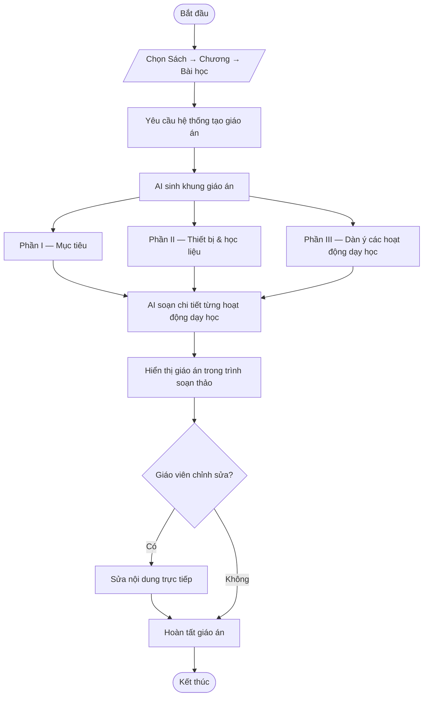

# Workflow — Quy trình tạo giáo án (5512)

Sơ đồ mô tả các bước chính khi giáo viên tạo một giáo án theo Công văn 5512
trong EDUA System.

## Tóm tắt các bước

1. **Chọn bài học** — giáo viên chọn Sách → Chương → Bài.
2. **Yêu cầu tạo** — gửi yêu cầu sinh giáo án.
3. **Sinh khung** — AI tạo Phần I (Mục tiêu), Phần II (Thiết bị & học liệu),
   Phần III (dàn ý các hoạt động).
4. **Soạn chi tiết** — AI điền chi tiết cho từng hoạt động dạy học.
5. **Hiển thị & chỉnh sửa** — giáo án hiện trong trình soạn thảo, giáo viên có thể
   sửa trực tiếp trước khi hoàn tất.
