# Activity Diagram - AI Workflow and Prompt Orchestration

Tài liệu này mô tả cách EDUA System điều phối các yêu cầu AI để sinh nội dung dạy học. Mermaid chưa có cú pháp `activityDiagram` riêng như PlantUML, nên file này dùng `flowchart` với ký hiệu activity diagram: start/end node, action node, decision node và swimlane bằng `subgraph`.

Trong EDUA, AI không đóng vai trò autonomous agent. Model không tự gọi tool, không tự truy cập database và không tự thực hiện side effect. Frontend chỉ gửi ngữ cảnh bài học, yêu cầu của giáo viên và `sessionId` nếu cần streaming; toàn bộ việc kiểm tra request, tạo prompt, gọi provider, parse/validate kết quả và trả kết quả đều đi qua Backend service layer và `AiClient` gateway.

## Activity Diagram Tổng Quát

```mermaid
flowchart TD
    start([Bắt đầu])

    subgraph FE["Frontend"]
        fePrepare["Nhập/chọn ngữ cảnh dạy học<br/>book, chapter, lesson, lesson content, user prompt"]
        feSend["Gửi request đến Backend<br/>kèm sessionId nếu cần streaming"]
        feWaiting["Chờ response đồng bộ<br/>hoặc STOMP progress events"]
        feProgress["Nhận tiến trình qua STOMP topic<br/>FRAME_READY, PART_READY, ACTIVITY_READY, DONE"]
        feResult["Hiển thị kết quả trong editor/result view"]
        feError["Hiển thị lỗi để người dùng sửa input hoặc thử lại"]
    end

    subgraph API["Backend Presentation Layer"]
        controller["REST Controller nhận request<br/>LessonPlan, Slide, Practice Exam, Slide Design"]
        validateHttp{"Request hợp lệ?"}
        accepted["Trả 202 Accepted cho luồng async/streaming"]
        response["Trả response đồng bộ cho Frontend"]
        errorResponse["Trả 4xx/5xx có thông điệp lỗi"]
    end

    subgraph SERVICE["Service / Use Case Layer"]
        usecase["Orchestrate use case<br/>load context, enforce rule, chọn workflow"]
        rateLimit["Kiểm soát tần suất endpoint AI"]
        loadContext["Đọc ngữ cảnh hệ thống<br/>SGK số hóa, lesson plan, prompt template, session state"]
        chooseMode{"Cần streaming/parallel?"}
        asyncJob["Chạy job nền bằng executor"]
        syncJob["Xử lý đồng bộ trong request hiện tại"]
    end

    subgraph PROMPT["Prompt Orchestration"]
        promptBuilder["Prompt Builder tạo prompt có cấu trúc<br/>system prompt + teaching context + user instruction"]
        dataBoundary["Bọc input người dùng/file thành data<br/>không coi là lệnh hệ thống"]
        fanout{"Cần tách nhiều AI call?"}
        parallelCalls["Fan-out các call độc lập<br/>ví dụ: mục tiêu, học liệu, dàn ý, từng hoạt động/slide"]
    end

    subgraph AI["AI Gateway and Provider"]
        aiClient["AiClient gateway<br/>generate(prompt) hoặc generate(prompt, image, mimeType)"]
        provider["AI Provider<br/>OpenAI, DeepSeek hoặc fallback configured adapter"]
        providerOk{"Provider trả kết quả?"}
    end

    subgraph POST["Post-processing / Persistence / Delivery"]
        parser["Response Parser<br/>strip fence, repair JSON nếu cần, map về DTO/domain"]
        validator["Output Validator<br/>kiểm tra schema, id, số lượng, content plan, field bắt buộc"]
        validOutput{"Output hợp lệ?"}
        retry{"Còn lượt retry hợp lý?"}
        persist{"Workflow có lưu DB/storage?"}
        save["Lưu database/storage nếu workflow yêu cầu"]
        finalModel["Tạo result model cho Frontend"]
        stream["Publish progress/result qua STOMP"]
        delivery{"Cách trả kết quả?"}
    end

    start --> fePrepare --> feSend
    feSend --> feWaiting
    feSend --> controller --> validateHttp

    validateHttp -- "Không" --> errorResponse --> feError --> stopError([Kết thúc với lỗi])
    validateHttp -- "Có" --> usecase --> rateLimit --> loadContext --> chooseMode

    chooseMode -- "Async/streaming" --> accepted --> feWaiting
    chooseMode -- "Async/streaming" --> asyncJob
    chooseMode -- "Đồng bộ" --> syncJob

    asyncJob --> promptBuilder
    syncJob --> promptBuilder
    promptBuilder --> dataBoundary --> fanout
    fanout -- "Có" --> parallelCalls --> aiClient
    fanout -- "Không" --> aiClient

    aiClient --> provider --> providerOk
    providerOk -- "Lỗi provider / timeout" --> retry
    providerOk -- "Có raw output" --> parser --> validator --> validOutput
    validOutput -- "Không" --> retry
    retry -- "Có" --> promptBuilder
    retry -- "Không" --> errorResponse

    validOutput -- "Có" --> persist
    persist -- "Có" --> save --> finalModel
    persist -- "Không" --> finalModel
    finalModel --> delivery
    delivery -- "Đồng bộ" --> response --> feResult --> stopOk([Kết thúc thành công])
    delivery -- "Streaming" --> stream --> feProgress --> feResult --> stopOk

    classDef actor fill:#eef7ff,stroke:#2563eb,stroke-width:1px;
    classDef backend fill:#f8fafc,stroke:#475569,stroke-width:1px;
    classDef decision fill:#fff7ed,stroke:#ea580c,stroke-width:1px;
    classDef ai fill:#f0fdf4,stroke:#16a34a,stroke-width:1px;
    classDef error fill:#fef2f2,stroke:#dc2626,stroke-width:1px;

    class fePrepare,feSend,feWaiting,feProgress,feResult actor;
    class controller,usecase,loadContext,rateLimit,promptBuilder,dataBoundary,parallelCalls,parser,validator,persist,save,stream,finalModel,response,accepted backend;
    class validateHttp,chooseMode,fanout,providerOk,validOutput,retry,delivery decision;
    class aiClient,provider ai;
    class feError,errorResponse,stopError error;
```



## Activity Diagram Luồng Streaming Giáo Án 5512

Luồng streaming minh họa rõ nhất cách EDUA dùng AI làm lớp orchestration. Controller trả `202 Accepted` ngay, sau đó use case chạy nền và đẩy tiến trình về `/topic/lesson-plan/{sessionId}`. Nếu sinh được dàn ý Phần III, hệ thống có thể tiếp tục điền chi tiết từng hoạt động ngay cả khi Phần I hoặc Phần II lỗi lẻ.

```mermaid
flowchart TD
    s([Bắt đầu])

    subgraph FE["Frontend"]
        input["Giáo viên chọn bài học và nhập userPrompt"]
        subscribe["Subscribe STOMP topic<br/>/topic/lesson-plan/sessionId"]
        call["POST /api/lesson-plans/generate-stream"]
        waitEvents["Chờ streaming events"]
        renderFrame["Render khung giáo án<br/>Phần I, Phần II, dàn ý Phần III"]
        renderActivity["Cập nhật từng hoạt động khi sẵn sàng"]
        renderDone["Mở editor với kết quả sinh được"]
        renderFailed["Hiển thị lỗi streaming"]
    end

    subgraph BE["Backend"]
        controller["LessonPlanController.generateStream"]
        accepted["HTTP 202 Accepted"]
        startJob["GenerateLessonPlanStreamUseCase.start<br/>submit job nền"]
        buildBase["Tạo GenerateLessonPlanRequest<br/>từ bookId, chapterId, lessonId, userPrompt"]
        forkFrame["Chạy song song 3 call khung"]
        genObj["generateObjectives"]
        genMaterials["generateMaterials"]
        genFrame["generateActivitiesFrame"]
        joinFrame["Join kết quả khung<br/>Objectives/Materials optional, dàn ý III bắt buộc"]
        frameOk{"Dàn ý Phần III hợp lệ?"}
        publishFrame["publishFrameReady"]
        loadKnowledge["loadKnowledge và serialize context"]
        loopActivities["Với mỗi Activity5512 trong dàn ý"]
        detailOne["detailOne<br/>tạo prompt riêng cho từng hoạt động"]
        activityOk{"Hoạt động sinh chi tiết thành công?"}
        activityReady["publishActivityReady"]
        activityFailed["publishActivityFailed"]
        allDone{"Đã xử lý tất cả hoạt động?"}
        done["publishDone"]
        failed["publishFailed"]
    end

    subgraph AI["AI Gateway and Provider"]
        objAi["PromptBuilder -> AiClient -> Provider<br/>parse/validate Objectives"]
        matAi["PromptBuilder -> AiClient -> Provider<br/>parse/validate Materials"]
        frameAi["PromptBuilder -> AiClient -> Provider<br/>parse/validate activity frame"]
        detailAi["PromptBuilder -> AiClient -> Provider<br/>parse/validate Activity5512 detail"]
    end

    s --> input --> subscribe --> call --> controller
    controller --> accepted --> waitEvents
    controller --> startJob --> buildBase --> forkFrame

    forkFrame --> genObj --> objAi --> joinFrame
    forkFrame --> genMaterials --> matAi --> joinFrame
    forkFrame --> genFrame --> frameAi --> frameOk
    frameOk -- "Không" --> failed --> renderFailed --> e1([Kết thúc với lỗi])
    frameOk -- "Có" --> joinFrame --> publishFrame --> renderFrame

    publishFrame --> loadKnowledge --> loopActivities --> detailOne --> detailAi --> activityOk
    activityOk -- "Có" --> activityReady --> renderActivity --> allDone
    activityOk -- "Không" --> activityFailed --> renderActivity --> allDone
    allDone -- "Chưa" --> loopActivities
    allDone -- "Rồi" --> done --> renderDone --> e2([Kết thúc thành công])
```

## Giải Thích Trong Hệ Thống EDUA

1. Frontend không gọi OpenAI/DeepSeek trực tiếp. Mọi yêu cầu AI đi qua REST API của Backend để giữ quyền truy cập, rate limit, prompt template và logging nằm trong một boundary.
2. Service/use case là nơi điều phối nghiệp vụ: tải ngữ cảnh SGK, lesson plan hoặc session state; quyết định workflow đồng bộ hay streaming; tách các pha có thể chạy song song.
3. Prompt Builder là nơi ghép system prompt, teaching context và user instruction. Input của giáo viên/file được bọc như dữ liệu tham khảo, không phải lệnh có quyền cao hơn instruction của hệ thống.
4. `AiClient` chỉ là gateway kỹ thuật đến provider. Nó không nắm nghiệp vụ, không tự query database và không cho model thực hiện tool/action.
5. Kết quả AI luôn đi qua parser và validator trước khi trả về. Với các workflow JSON như slide outline hoặc giáo án, Backend kiểm tra schema, id, số lượng phần/slide/hoạt động và field bắt buộc.
6. Với luồng streaming, Backend đẩy kết quả từng phần qua STOMP để Frontend cập nhật tiến trình, tránh để request HTTP chờ quá lâu và cho phép một phần lỗi mà các phần khác vẫn hiển thị được.
